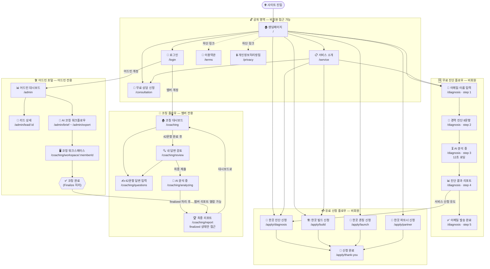
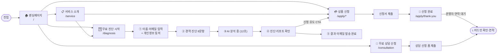
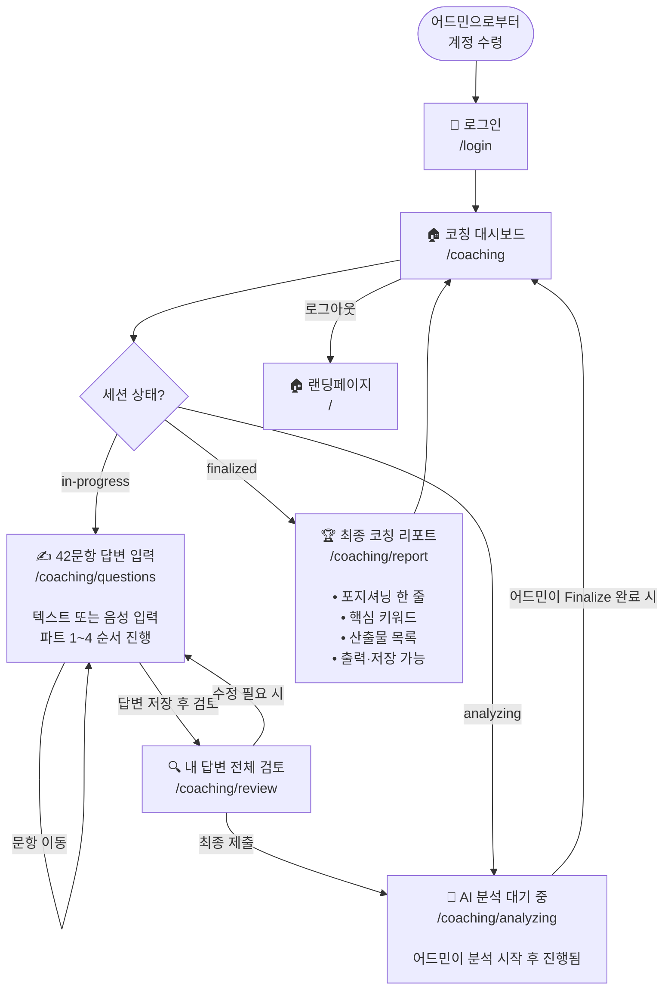
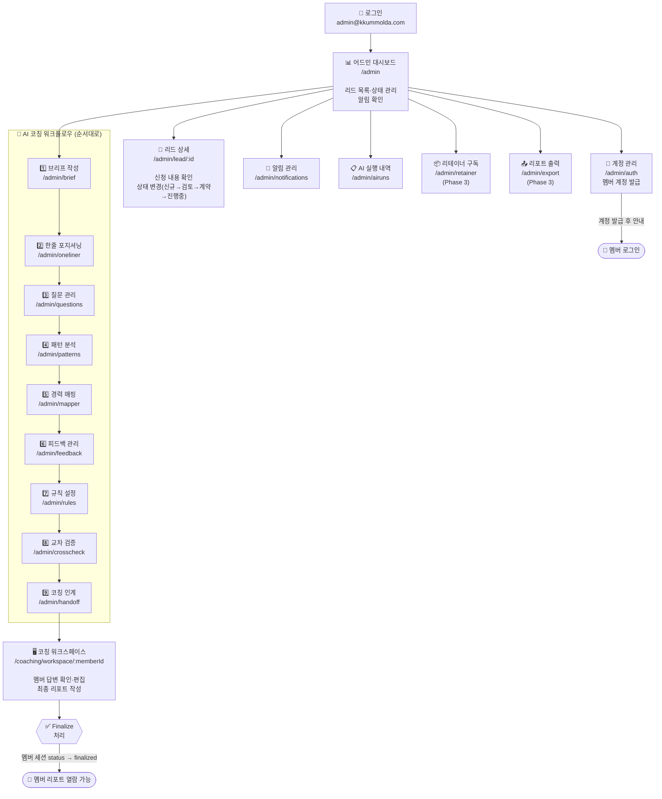
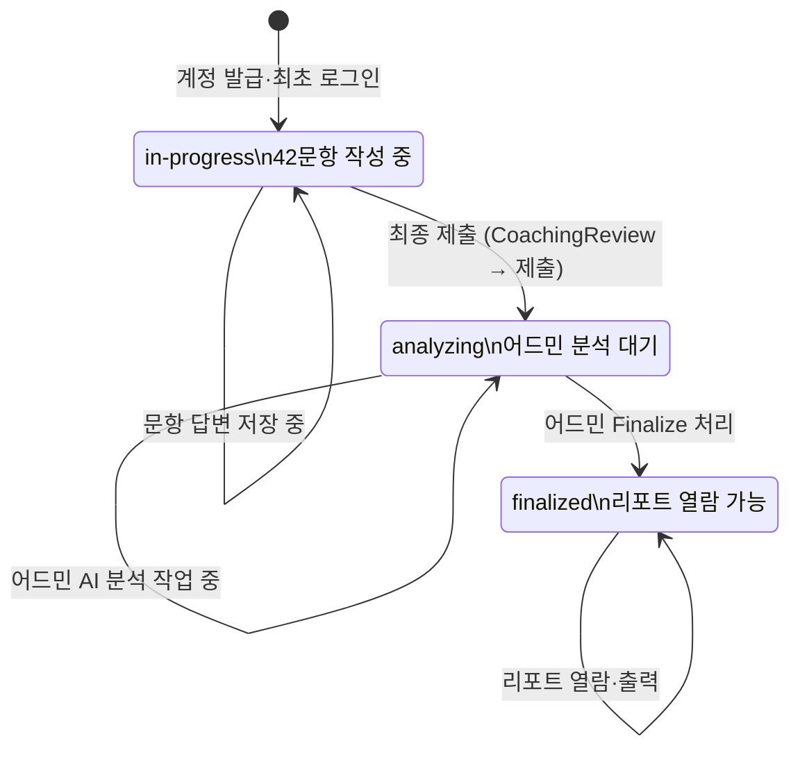

# 한끗프로젝트 전체 페이지 순서도

> 사용자 유형 3가지: **비회원(Guest)** · **멤버(Member)** · **어드민(Admin)**  
> 최종 업데이트: 2026-06-20

---

## 1. 전체 플로우 개요

---

## 2. 비회원(Guest) 플로우

---

## 3. 멤버(Member) 코칭 플로우

---

## 4. 어드민(Admin) 운영 플로우

---

## 5. 전체 페이지 목록

### 공개 페이지 (비회원 접근 가능)

| 경로 | 페이지명 | 역할 |
|---|---|---|
| `/` | 랜딩페이지 | 서비스 진입점, 전체 안내 |
| `/service` | 서비스 소개 | 방법론·산출물·비교표 상세 |
| `/consultation` | 무료 상담 신청 | 상담 신청 폼 |
| `/login` | 로그인 | 멤버·어드민 공통 로그인 |
| `/terms` | 이용약관 | 법적 약관 |
| `/privacy` | 개인정보처리방침 | 개인정보 처리 안내 |

### 무료 진단 플로우 (비회원, `/diagnosis` 단일 라우트)

| 단계 | 컴포넌트 | 역할 |
|---|---|---|
| Step 1 | `EmailCollect` | 이름·이메일·경력연수 입력, 개인정보 동의 |
| Step 2 | `DiagnosisForm` | 경력 진단 8문항 응답 |
| Step 3 | `AnalysisLoading` | AI 분석 로딩 (12초) |
| Step 4 | `Report` | 진단 결과 리포트 확인 |
| Step 5 | `Complete` | 이메일 발송 완료 안내 |

### 유료 서비스 신청 플로우 (비회원)

| 경로 | 페이지명 | 상품 |
|---|---|---|
| `/apply/diagnosis` | 한끗 진단 신청 | 50만원 · 진단 패키지 |
| `/apply/build` | 한끗 빌드 신청 | 350만원 · 경력 자산화 |
| `/apply/launch` | 한끗 론칭 신청 | 별도 문의 · 실전 런칭 |
| `/apply/partner` | 한끗 파트너 신청 | 별도 문의 · 장기 파트너십 |
| `/apply/thank-you` | 신청 완료 | 신청 접수 확인 |

### 코칭 플로우 (멤버 전용)

| 경로 | 페이지명 | 역할 | 접근 조건 |
|---|---|---|---|
| `/coaching` | 코칭 대시보드 | 진행 현황·상태 확인 | 멤버 로그인 |
| `/coaching/questions` | 42문항 답변 입력 | 텍스트·음성 입력, 파트별 진행 | 멤버 로그인 |
| `/coaching/review` | 내 답변 검토 | 제출 전 전체 답변 검토·수정 | 멤버 로그인 |
| `/coaching/analyzing` | AI 분석 대기 | 어드민 분석 중 대기 화면 | 멤버 로그인 |
| `/coaching/report` | 최종 코칭 리포트 | 포지셔닝·산출물 확인·출력 | finalized 상태 |

### 어드민 포털 (어드민 전용)

| 경로 | 페이지명 | 역할 |
|---|---|---|
| `/admin` | 어드민 대시보드 | 리드 목록·상태 관리·알림 |
| `/admin/lead/:id` | 리드 상세 | 개별 신청자 정보·상태 변경 |
| `/admin/notifications` | 알림 관리 | 신규 신청·메시지 알림 |
| `/admin/auth` | 계정 관리 | 멤버 계정 발급·관리 |
| `/admin/airuns` | AI 실행 내역 | AI 분석 기록 확인 |
| `/admin/brief` | 브리프 작성 | AI 코칭 워크플로우 Step 1 |
| `/admin/oneliner` | 한줄 포지셔닝 | AI 코칭 워크플로우 Step 2 |
| `/admin/questions` | 질문 관리 | AI 코칭 워크플로우 Step 3 |
| `/admin/patterns` | 패턴 분석 | AI 코칭 워크플로우 Step 4 |
| `/admin/mapper` | 경력 매핑 | AI 코칭 워크플로우 Step 5 |
| `/admin/feedback` | 피드백 관리 | AI 코칭 워크플로우 Step 6 |
| `/admin/rules` | 규칙 설정 | AI 코칭 워크플로우 Step 7 |
| `/admin/crosscheck` | 교차 검증 | AI 코칭 워크플로우 Step 8 |
| `/admin/handoff` | 코칭 인계 | AI 코칭 워크플로우 Step 9 |
| `/coaching/workspace/:memberId` | 코칭 워크스페이스 | 멤버 답변 확인·최종 리포트 작성 |
| `/admin/retainer` | 리테이너 구독 | 구독 관리 (Phase 3) |
| `/admin/export` | 리포트 출력 | PPT·PDF 출력 (Phase 3) |

---

## 6. 권한별 접근 범위

```mermaid
flowchart LR
    subgraph GUEST["👥 비회원 (Guest)"]
        G1["랜딩 /"]
        G2["서비스 소개 /service"]
        G3["무료 진단 /diagnosis"]
        G4["상담 신청 /consultation"]
        G5["상품 신청 /apply/*"]
        G6["로그인 /login"]
        G7["이용약관 /terms"]
        G8["개인정보처리방침 /privacy"]
    end

    subgraph MEMBER["👤 멤버 (Member)"]
        M0["비회원 전체 포함"]
        M1["코칭 대시보드 /coaching"]
        M2["42문항 입력 /coaching/questions"]
        M3["답변 검토 /coaching/review"]
        M4["AI 분석 대기 /coaching/analyzing"]
        M5["최종 리포트 /coaching/report\n(finalized 후)"]
    end

    subgraph ADMIN["🛡️ 어드민 (Admin)"]
        A0["멤버 전체 포함"]
        A1["어드민 포털 /admin/*"]
        A2["코칭 워크스페이스\n/coaching/workspace/:id"]
    end

    GUEST --> MEMBER
    MEMBER --> ADMIN
```

---

## 7. 핵심 상태 전환

멤버의 코칭 세션은 4가지 상태로 관리됩니다.

---

*이 문서는 `src/App.tsx` 라우트 구성을 기반으로 작성되었습니다.*
