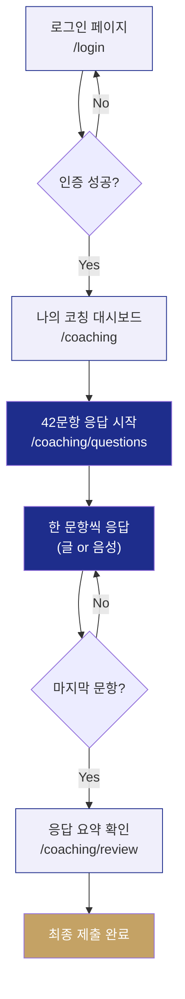

# 유료 한끗 진단 — 42문항 코칭 질문 응답 페이지 설계

42문항 코칭 질문에 신청자가 직접 답변을 작성하는 멤버 전용 페이지의 설계 제안서입니다.
글쓰기 + 음성 녹음 두 가지 입력 방식을 제공하며, **5060 중년 사용자**의 디지털 접근성을 최우선으로 고려합니다.

---

## User Review Required

> [!IMPORTANT]
> 아래 설계안을 검토하시고, 수정하고 싶은 부분이나 추가 요구사항을 알려주세요.
> 승인해 주시면 바로 구현에 들어가겠습니다.

---

## Open Questions

> [!IMPORTANT]
> **Q1. 42문항 질문 데이터는 어디서 가져오나요?**
> 현재 [content.ts](file:///e:/%EA%BF%88%EB%AA%B0%EB%8B%A4/%EC%99%B8%EB%B6%80%EC%82%AC%EC%97%85/2026/%EB%AA%A8%EB%91%90%EC%9D%98%EC%97%B0%EA%B5%AC%EC%86%8C/career-translate-lab/src/data/content.ts)에 `DIAGNOSTIC_QUESTIONS`로 16문항이 정의되어 있습니다.
> - **선택지 A**: 이 16문항을 42문항으로 확장해 주시면 그대로 사용합니다.
> - **선택지 B**: 별도 파일(엑셀, 텍스트 등)로 42문항을 전달해 주시면 데이터화합니다.
> - **선택지 C**: 기존 16문항 + 카테고리별로 추가 질문을 제가 구조만 잡아둘 테니 나중에 채워 넣을 수 있게 합니다.

> [!IMPORTANT]
> **Q2. 인증(로그인) 방식을 어느 수준까지 구현할까요?**
> 현재 [Login.tsx](file:///e:/%EA%BF%88%EB%AA%B0%EB%8B%A4/%EC%99%B8%EB%B6%80%EC%82%AC%EC%97%85/2026/%EB%AA%A8%EB%91%90%EC%9D%98%EC%97%B0%EA%B5%AC%EC%86%8C/career-translate-lab/src/pages/Login.tsx)에 로그인 UI가 있지만, 실제 인증 로직은 미구현 상태입니다.
> - **선택지 A (추천)**: 로컬 프로토타입 — 관리자가 `admin` 페이지에서 멤버 ID/비밀번호를 발급하면, 로컬스토리지에 저장. 해당 ID로 로그인하면 42문항 응답 페이지 접근 가능. 실서비스 전환 시 Supabase 등으로 교체.
> - **선택지 B**: 단순 접근 코드(1회용) — 운영자가 신청자에게 접근 코드(예: `HK-2026-0001`)를 발급, 이 코드만 입력하면 접근 가능.
> - **선택지 C**: 인증은 나중에 — 지금은 누구나 URL로 접근 가능하게 두고, 기능 자체만 먼저 완성.

> [!IMPORTANT]
> **Q3. 음성 녹음 데이터 저장 위치는?**
> - **선택지 A (추천, 프로토타입)**: 브라우저 로컬(IndexedDB)에 저장. 관리자가 admin 페이지에서 재생/다운로드 가능.
> - **선택지 B**: Netlify Blob Storage 또는 외부 스토리지(S3 등)에 업로드 — 실서비스용이지만 추가 인프라 설정 필요.

---

## 핵심 설계 원칙: 5060 중년 사용자를 위한 UX

### 왜 특별한 접근이 필요한가

| 5060 사용자 특성 | 설계 대응 |
|---|---|
| 작은 글씨 읽기 불편 | 본문 **18px 이상**, 질문 텍스트 **24~28px** |
| 복잡한 UI에 위축감 | 한 화면에 **딱 1문항**만 표시 (위저드 패턴) |
| 타이핑 속도 느림, 한글 입력 어려움 | **음성 녹음**을 동등한 1순위 입력 수단으로 제공 |
| 실수로 날릴까봐 불안 | **자동 저장** + 저장 확인 표시 + "이어서 작성" 지원 |
| 진행률 파악 어려움 | 상단 **프로그레스 바** + **N/42** 카운터 |
| 장시간 집중 어려움 | **언제든 나갔다 돌아와도** 이전 답변 유지 |
| 버튼 터치 영역 작음 | 최소 터치 타깃 **56px** (모바일) |

---

## 전체 사용자 흐름 (User Flow)



---

## 페이지별 상세 설계

### 1. 나의 코칭 대시보드 (`/coaching`)

로그인 후 처음 보는 화면. **현재 상태를 한눈에 파악**할 수 있는 간결한 대시보드.

```
┌─────────────────────────────────────────────┐
│  👋 김지영님, 한끗 진단에 오신 것을 환영합니다     │
│                                             │
│  ┌─────────────────────────────────────┐    │
│  │  📝 42문항 코칭 질문                 │    │
│  │                                     │    │
│  │  ■■■■■■□□□□□□□□□□  진행률 38%        │    │
│  │  응답 완료: 16 / 42                  │    │
│  │  마지막 저장: 2026-05-30 오전 10:23   │    │
│  │                                     │    │
│  │  [ 🖊️ 이어서 작성하기 ]               │    │
│  └─────────────────────────────────────┘    │
│                                             │
│  💡 안내                                    │
│  · 한 번에 다 하지 않으셔도 됩니다              │
│  · 언제든 나갔다가 돌아오시면 이어서 작성됩니다    │
│  · 글로 쓰셔도, 말로 녹음하셔도 모두 됩니다       │
│                                             │
│  운영자 연락처: 070-4090-2161                 │
└─────────────────────────────────────────────┘
```

**핵심 기능:**
- 전체 진행률 시각화 (프로그레스 바 + 숫자)
- "이어서 작성하기" 버튼 → 마지막으로 작성하던 문항으로 바로 이동
- 마지막 저장 시각 표시 (안심감 제공)
- 운영자 연락처 항상 표시 (도움 요청 용이)

---

### 2. 문항 응답 화면 (`/coaching/questions`) — **핵심 페이지**

#### 레이아웃: 한 문항 한 화면 (위저드 패턴)

**이유**: 42문항을 한 페이지에 나열하면 5060 사용자가 압도감을 느낌. 한 문항씩 보여주면 집중도가 높아지고 "이것만 하면 된다"는 심리적 안정감 제공.

```
┌─────────────────────────────────────────────┐
│  경력 코칭 질문 · 3 / 42          ■■■□□ 7%  │
│─────────────────────────────────────────────│
│                                             │
│  Q3                                         │
│                                             │
│  가장 오래, 가장 깊이 해온                    │
│  전문 영역은 무엇인가요?                      │
│                                             │
│  💡 산업·기능·주제 어떤 단위든 좋습니다.         │
│     햇수와 함께 적어보세요.                    │
│                                             │
│  ┌─────────────────────────────────────┐    │
│  │  입력 방법을 선택해 주세요              │    │
│  │                                     │    │
│  │  [ ✏️ 글로 쓰기 ]  [ 🎤 말로 녹음 ]   │    │
│  └─────────────────────────────────────┘    │
│                                             │
│  (선택 후 글쓰기 영역 또는 녹음 영역 표시)      │
│                                             │
│  ← 이전    [ 저장하고 쉬기 ]    다음 →        │
│                                             │
└─────────────────────────────────────────────┘
```

#### 2-A. 글쓰기 모드

```
┌─────────────────────────────────────────────┐
│  ✏️ 글로 쓰기                   🔄 녹음으로  │
│                                             │
│  ┌─────────────────────────────────────┐    │
│  │                                     │    │
│  │  (큰 글씨 텍스트 영역, 18px)          │    │
│  │  최소 8줄 높이                       │    │
│  │  행간 1.8                           │    │
│  │                                     │    │
│  │                                     │    │
│  └─────────────────────────────────────┘    │
│  128 / 2000자                               │
│                                             │
│  ✅ 자동 저장됨 (10:23)                      │
└─────────────────────────────────────────────┘
```

**글쓰기 모드 특징:**
- textarea 높이 충분히 (최소 200px, 모바일에서도 8줄 이상)
- 글자 크기 18px, 행간 1.8 (가독성 극대화)
- placeholder에 예시 답변 표시 (막막함 해소)
- 입력 중 **3초 간격 자동 저장** + "자동 저장됨" 표시
- 글자수 카운트 (상한 2000자)
- IME 버그 방지 적용 (이전에 수정한 패턴 재활용)

#### 2-B. 음성 녹음 모드

```
┌─────────────────────────────────────────────┐
│  🎤 말로 녹음                   🔄 글쓰기로  │
│                                             │
│  ┌─────────────────────────────────────┐    │
│  │                                     │    │
│  │         🔴  0:47 / 3:00             │    │
│  │                                     │    │
│  │    ▁▂▃▅▇▅▃▂▁▂▃▅▆▅▃▁  (파형 시각화)   │    │
│  │                                     │    │
│  │                                     │    │
│  │  [ ⏹ 중지 ]     ← 녹음 중...         │    │
│  └─────────────────────────────────────┘    │
│                                             │
│  💡 편하게 말씀하세요.                        │
│     녹음 내용은 운영자만 들을 수 있습니다.       │
│     최대 3분까지 녹음 가능합니다.               │
│                                             │
│  ✅ 자동 저장됨                              │
└─────────────────────────────────────────────┘
```

**녹음 완료 후:**

```
┌─────────────────────────────────────────────┐
│  🎤 녹음 완료                               │
│                                             │
│  ┌─────────────────────────────────────┐    │
│  │  ▶ 녹음 내용 듣기          0:47      │    │
│  │  ━━━━━━━━━━━━━━━━━━━  진행 바        │    │
│  └─────────────────────────────────────┘    │
│                                             │
│  [ 🔄 다시 녹음하기 ]  [ ✏️ 글도 추가하기 ]    │
│                                             │
│  ✅ 저장 완료                                │
└─────────────────────────────────────────────┘
```

**음성 녹음 모드 특징:**
- **큰 녹음 버튼** (원형, 최소 80px) — 터치 오류 방지
- 녹음 상태 시각 피드백 (빨간 점 깜빡임 + 실시간 파형)
- **최대 3분** 제한 (너무 길면 관리 어려움, 너무 짧으면 표현 어려움)
- 녹음 후 **즉시 재생** 확인 가능
- "다시 녹음하기" — 불만족 시 재녹음 (이전 녹음 덮어쓰기)
- "글도 추가하기" — 녹음 + 텍스트 보충 가능 (둘 다 저장)
- 마이크 권한 요청 시 **친절한 안내 화면** (왜 필요한지 설명)
- Web MediaRecorder API 사용 (추가 라이브러리 불필요)

#### 2-C. 네비게이션 (하단 버튼 바)

```
┌──────────────────────────────────────────────┐
│  ← 이전    [ 💾 저장하고 쉬기 ]     다음 →    │
└──────────────────────────────────────────────┘
```

- **이전/다음**: 문항 간 이동. 답변이 비어 있어도 이동 가능 (빈 문항은 대시보드에서 확인)
- **저장하고 쉬기**: 현재까지 답변 모두 저장 → 대시보드로 복귀. 위로 메시지 표시.
- 빈 문항으로 다음 이동 시 "건너뛰셔도 됩니다. 나중에 돌아와서 작성하실 수 있어요." 안내

#### 2-D. 문항 목록 보기 (사이드/하단)

42문항 전체 목록을 한눈에 보고 원하는 문항으로 바로 이동할 수 있는 보조 네비게이션:

```
┌────────────────────────┐
│  📋 전체 문항 목록       │
│                        │
│  정체성 진단 (3문항)     │
│  ✅ Q1  ✅ Q2  ⬜ Q3   │
│                        │
│  핵심 가치 (6문항)       │
│  ✅ Q4  ⬜ Q5  ⬜ Q6   │
│  ⬜ Q7  ⬜ Q8  ⬜ Q9   │
│  ...                   │
└────────────────────────┘
```

- 데스크톱: 좌측 사이드바로 항상 표시 (접기/펼치기 가능)
- 모바일: 하단 시트(슬라이드 업)로 "전체 목록 보기" 버튼 탭 시 표시
- 카테고리별 그룹핑 (정체성 진단, 핵심 가치, 강점과 전문성 등 7개 영역)
- 완료/미완료 상태 아이콘 (✅ / ⬜)
- 현재 문항 하이라이트

---

### 3. 응답 요약 확인 화면 (`/coaching/review`)

42문항 모두 답변(또는 건너뛰기) 후 최종 확인:

```
┌─────────────────────────────────────────────┐
│  📋 응답 요약                               │
│                                             │
│  완료 38문항 / 녹음 12건 / 미응답 4문항         │
│                                             │
│  정체성 진단 ──────────────────────────       │
│  Q1. 직함 없이 나를 소개한다면...              │
│  → "저는 사람들의 강점을 발견하고..."   ✏️ 수정 │
│                                             │
│  Q2. 가장 자랑스러운 순간...                   │
│  → 🎤 녹음 (1:23)  ▶ 듣기            🔄 재녹음│
│                                             │
│  Q3. ───                              ✏️ 작성│
│                                             │
│  ...                                        │
│                                             │
│  [ 최종 제출하기 ]                             │
│  ⚠️ 제출 후에는 수정할 수 없습니다              │
│                                             │
└─────────────────────────────────────────────┘
```

- 전체 응답 스크롤 리뷰
- 텍스트 답변: 앞부분 2줄 미리보기 + "수정" 버튼
- 녹음 답변: 재생 버튼 + 길이 + "재녹음" 버튼
- 미응답 문항: 빈 상태 표시 + "작성" 버튼
- **미응답이 있어도 제출 가능** (다만 경고 표시)

---

### 4. 관리자 확인 (`/admin` 기존 페이지 확장)

기존 [Admin.tsx](file:///e:/%EA%BF%88%EB%AA%B0%EB%8B%A4/%EC%99%B8%EB%B6%80%EC%82%AC%EC%97%85/2026/%EB%AA%A8%EB%91%90%EC%9D%98%EC%97%B0%EA%B5%AC%EC%86%8C/career-translate-lab/src/pages/Admin.tsx) 리드 관리 화면에 **코칭 응답 탭** 추가:

- 멤버별 응답 목록 (42문항 × 멤버 수)
- 텍스트 답변: 전문 읽기
- 음성 답변: 브라우저에서 바로 재생 + 다운로드
- 진행률 확인 (몇 문항 완료했는지)
- 응답 상태 (작성 중 / 제출 완료)

---

## 기술 구현 방안

### 파일 구조 (신규)

```
src/
├── pages/
│   ├── coaching/
│   │   ├── CoachingDashboard.tsx     [NEW] 나의 코칭 대시보드
│   │   ├── CoachingQuestions.tsx      [NEW] 42문항 위저드 (핵심)
│   │   └── CoachingReview.tsx         [NEW] 응답 요약 확인
│
├── components/
│   ├── coaching/
│   │   ├── QuestionCard.tsx           [NEW] 개별 문항 카드
│   │   ├── TextInputMode.tsx          [NEW] 글쓰기 모드
│   │   ├── VoiceRecordMode.tsx        [NEW] 음성 녹음 모드
│   │   ├── VoicePlayer.tsx            [NEW] 음성 재생 컴포넌트
│   │   ├── QuestionNav.tsx            [NEW] 문항 목록 네비게이션
│   │   ├── ProgressHeader.tsx         [NEW] 프로그레스 헤더
│   │   └── MicPermissionGuide.tsx     [NEW] 마이크 권한 안내
│
├── store/
│   ├── coachingStore.ts               [NEW] 42문항 응답 상태 관리
│   └── authStore.ts                   [NEW] 간이 인증 상태 관리
│
├── lib/
│   └── audioRecorder.ts               [NEW] Web Audio API 녹음 유틸
│
├── data/
│   └── content.ts                     [MODIFY] 42문항 데이터 추가/확장

[MODIFY] src/App.tsx                   — 라우트 3개 추가
[MODIFY] src/pages/Login.tsx           — 인증 로직 연결
[MODIFY] src/pages/Admin.tsx           — 코칭 응답 관리 탭 추가
```

### 핵심 기술 스택

| 영역 | 기술 | 비고 |
|---|---|---|
| 음성 녹음 | `MediaRecorder` API | 브라우저 내장, 추가 패키지 없음 |
| 음성 저장 | `IndexedDB` (via 간단한 래퍼) | 대용량 바이너리 저장에 적합 |
| 음성 포맷 | `audio/webm` (Chrome) / `audio/mp4` (Safari) | 브라우저별 자동 감지 |
| 상태 관리 | `zustand` + `persist` | 기존 패턴과 동일 |
| 자동 저장 | `debounce` (3초) | 타이핑 멈추면 자동 저장 |
| 파형 시각화 | `AnalyserNode` + `Canvas` | Web Audio API 내장 |
| 인증 | `zustand` + `localStorage` | 프로토타입 수준 |

### 음성 녹음 브라우저 지원

| 브라우저 | MediaRecorder | 비고 |
|---|---|---|
| Chrome/Edge (데스크톱·모바일) | ✅ | 가장 안정적 |
| Safari 14.5+ (iOS·macOS) | ✅ | iOS에서도 동작 |
| Firefox | ✅ | 완전 지원 |
| Samsung Internet | ✅ | 5060 사용자 다수 사용 |

> [!NOTE]
> 5060 사용자의 주요 기기인 **갤럭시 스마트폰 + 삼성 인터넷/크롬**과 **아이폰 Safari** 모두 MediaRecorder를 지원합니다. 별도 폴리필이 필요 없습니다.

---

## 접근성·사용성 세부 체크리스트

- [ ] 질문 텍스트 최소 24px (모바일 22px)
- [ ] 본문/힌트 텍스트 최소 16px (모바일 17px)
- [ ] 버튼 최소 높이 56px, 터치 영역 48px 이상
- [ ] 색상 대비 WCAG AA 이상 (4.5:1)
- [ ] 녹음 상태 시각 + 텍스트 이중 표시 (색각 이상 대응)
- [ ] 자동 저장 후 "저장됨" 확인 표시 최소 3초 유지
- [ ] 에러 메시지는 빨간색 + 아이콘 + 텍스트 (삼중 인지)
- [ ] "저장하고 쉬기" 버튼에 격려 메시지 (예: "오늘 N문항이나 하셨습니다!")
- [ ] 마이크 권한 거부 시 대안 안내 (글쓰기로 전환 유도)

---

## Verification Plan

### 자동 테스트
- `tsc --noEmit` — 타입 에러 없음 확인
- `vite build` — 빌드 성공 확인

### 수동 검증
- 로그인 → 대시보드 → 문항 이동 → 글쓰기 입력 → 한글 IME 정상 동작 확인
- 음성 녹음 → 재생 → 재녹음 정상 동작 확인
- 브라우저 닫았다 열어도 답변 유지 (자동 저장) 확인
- 모바일(갤럭시/아이폰) 반응형 레이아웃 확인
- 관리자 페이지에서 멤버 응답 조회·재생 확인
