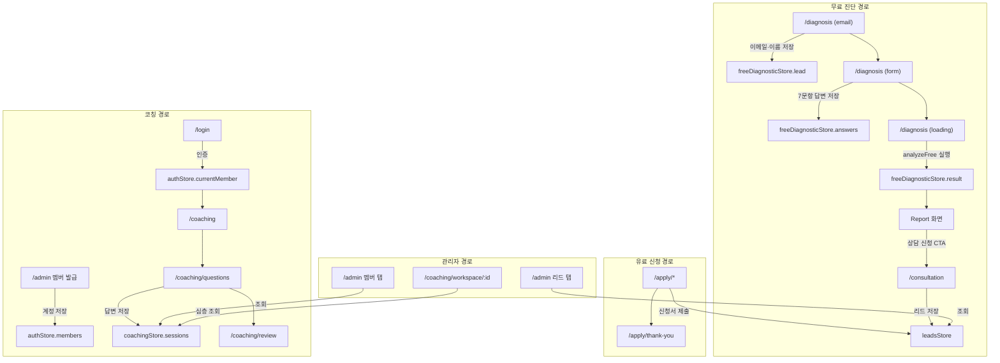

# 한끗프로젝트 — 제품 요구사항 정의서 (PRD)

| 항목 | 내용 |
| :--- | :--- |
| **문서 버전** | v2.0 (현행 사이트 기반) |
| **최종 작성일** | 2026-06-12 |
| **서비스명** | 한끗프로젝트 |
| **운영 주체** | 꿈몰다 · 이화진 대표 |
| **기준 코드베이스** | `career-translate-lab` (Vite + React 18 + TypeScript + Zustand + TailwindCSS) |
| **프로젝트 상태** | 프론트엔드 MVP 운영 중 (서버리스 · 로컬 스토리지 기반) |

---

## 1. 제품 비전 및 핵심 가치

### 1-1. 한 줄 정의

> **"50~60대 시니어 경력 전문가의 30년 경력을 시장이 선택하는 자산으로 번역하는 프리미엄 1:1 경력 자산화 서비스"**

### 1-2. 핵심 메시지

- **Hero Copy**: *"30년을 일했는데, 나를 소개하는 한 문장이 없습니다."*
- **브랜드 철학**: *"경력은 충분합니다. 부족한 건 번역입니다. 시장이 선택하는 자산으로 만듭니다."*
- **포지셔닝**: 강사 양성 과정이 아닌, 경력 있는 전문가의 경험을 **시장 통용 언어로 번역**하여 프로필·강의안·제안서 등의 **실전 산출물**로 만들어주는 **Done-for-you 하이브리드 코칭 서비스**

### 1-3. 타깃 고객

| 구분 | 설명 |
| :--- | :--- |
| **연령** | 50~60대 (핵심 타깃) |
| **직업** | 퇴직 예정 임원, 교수, 기술 전문가, 중소기업 대표 등 |
| **핵심 페인포인트** | 직함은 있지만 직함을 벗기면 자기를 설명할 언어가 없음. 경험은 풍부하지만 제안서·강의안·프로필 등 시장 진입 도구가 없음 |
| **니즈** | 강의, 자문, 컨설팅, B2B 제안 등 **시장 활동을 위한 즉시 활용 가능한 문서 자산** 완성 |

### 1-4. 해결하는 문제 (4대 페인포인트)

1. **직함 의존**: 직함 없이는 자기 소개가 불가능한 상태
2. **메시지 부재**: 풍부한 경험이 시장이 이해할 수 있는 메시지로 전환되지 않은 상태
3. **자산 산재**: 프로필, 소개문, 제안서, 강의안이 제각각으로 존재하여 일관된 브랜드 신뢰 부재
4. **실행 부재**: 혼자 만들면 멈추고, 외주를 맡기면 맥락이 빠지는 구조적 한계

---

## 2. 서비스 상품 체계

### 2-1. 4단계 패키지 구조

진입 장벽을 낮추고 점진적으로 업셀링 가능한 퍼널 구조로 설계되었습니다.

| STEP | 상품명 | 가격 | 기간 | 핵심 포지셔닝 |
|:---:|:---|:---:|:---:|:---|
| **1** | **한끗 진단** | 50만원 | 1주 | 내 경력의 시장 가치를 진단합니다 |
| **2** | **한끗 빌드** | 350만원 | 6주 | 강의안·프로필·제안서를 완성합니다 |
| **3** | **한끗 론칭** | 별도 문의 | 3개월 | 실제 무대와 수익 기회에 접근하도록 지원합니다 |
| **후속** | **한끗 파트너** | 별도 문의 | 월 단위 | 매월 점검하고, 다음 기회를 설계합니다 |

### 2-2. 상품별 포함 내역

#### STEP 1. 한끗 진단 (50만원 · 1주)

- 핵심 메시지(원라이너) 1문장 (코치 확정 전달)
- 강점 명제문 (간략 확정)
- 브랜드 요소 6종 미리보기 (핵심 가치, 타깃 페르소나, 브랜드 스토리, 핵심 카피, 채널 전략, 브랜드 WHY)
- 경력 자산 진단 리포트 (A4 3~5장)
- 자산화 로드맵 1장
- 30분 해석 미팅

#### STEP 2. 한끗 빌드 (350만원 · 6주)

- **기획 자산**: 브랜드 전략 브리프 (방향성·메시지 구조 정리본)
- **브랜드 언어 자산**: 확정 핵심 메시지(원라이너), 브랜드 매니페스토, 핵심 카피 3종
- **실전 도구**:
  - 전문가 프로필 1페이지
  - 대표 강의안 (60분)
  - B2B 제안서 템플릿
  - 채널 전략 가이드
  - 소개 멘트 3종

#### STEP 3. 한끗 론칭 (별도 문의 · 3개월)

- 한끗 빌드 전체 포함
- 강의 리허설·피드백 2회
- 온라인 프로필 페이지 제작
- 강의·자문 제안처 발굴 및 소개 지원
- 3개월 론칭 코칭, 월 2회

#### 후속. 한끗 파트너 (별도 문의 · 월 단위)

- 월 2회 코칭
- 콘텐츠 리뷰 및 업데이트
- 신규 기회 탐색 및 소개 지원
- 분기별 브랜드 점검 리포트

---

## 3. 사용자 여정 (User Journey)

### 3-1. 전체 서비스 플로우

```
[방문자]
  │
  ├─── 메인 랜딩 페이지 (/)
  │     ├─── "경력 가치 무료 진단받기" CTA ──→ 무료 7문항 자가 진단 (/diagnosis)
  │     ├─── "30분 무료 상담 신청하기" CTA ──→ 상담 신청 (/consultation)
  │     ├─── 서비스 소개 (/service)
  │     └─── 상품별 신청 CTA ──→ 신청서 (/apply/*)
  │
  ├─── 무료 자가 진단 플로우
  │     이메일·이름 입력 → 7문항 주관식 → 분석 로딩 → 진단 리포트 → 상담/신청 유도
  │
  ├─── 유료 상품 신청 플로우
  │     상품 확인 → 신청서 작성 → 신청 완료 (/apply/thank-you) → 리드 저장
  │
  ├─── 유료 코칭 플로우 (멤버 전용)
  │     관리자 계정 발급 → 멤버 로그인 (/login) → 코칭 대시보드 (/coaching)
  │     → 42문항 작성 (/coaching/questions) → 답변 리뷰 (/coaching/review)
  │     → AI 분석 (/coaching/analyzing) → 코칭 리포트 (/coaching/report)
  │
  └─── 관리자 운영 플로우
        어드민 콘솔 (/admin): 리드 CRM + 회원 계정 발급 + 답변/녹음 조회
        코칭 워크스페이스 (/coaching/workspace/:memberId)
```

### 3-2. 전환 퍼널 설계

```
방문 → 무료 진단 완료 → 진단 결과 확인 → 상담 신청 or 유료 신청 → 계약 → 계정 발급 → 코칭 진행
```

---

## 4. 페이지 구조 및 라우팅

### 4-1. 전체 라우트 맵

| 경로 | 페이지 | 설명 | 접근 제한 |
| :--- | :--- | :--- | :---: |
| `/` | Index.tsx | 메인 랜딩 페이지 (Hero + 가치 제안 + 비교표 + 프로세스 + 산출물 + 가격 + FAQ + CTA) | 공개 |
| `/service` | Service.tsx | 서비스 상세 소개 (한끗 방법론·추출·번역·자산화, 산출물 6종, 신뢰 섹션) | 공개 |
| `/diagnosis` | Diagnosis.tsx | 무료 7문항 자가 진단 (멀티스텝 폼) | 공개 |
| `/result` | Result.tsx | 구 진단 결과 페이지 (현재 미사용, 레거시) | 공개 |
| `/consultation` | Consultation.tsx | 30분 무료 상담 신청 폼 | 공개 |
| `/apply/diagnosis` | ApplyDiagnosis.tsx | 한끗 진단 50만원 신청 | 공개 |
| `/apply/build` | ApplyBuild.tsx | 한끗 빌드 350만원 신청 | 공개 |
| `/apply/launch` | ApplyLaunch.tsx | 한끗 론칭 신청 | 공개 |
| `/apply/partner` | ApplyPartner.tsx | 한끗 파트너 신청 | 공개 |
| `/apply/thank-you` | ApplyThankYou.tsx | 신청 접수 완료 안내 | 공개 |
| `/login` | Login.tsx | 멤버 로그인 (이메일 + 비밀번호) | 공개 |
| `/coaching` | CoachingDashboard.tsx | 42문항 코칭 진행률 대시보드 | 로그인 필요 |
| `/coaching/questions` | CoachingQuestions.tsx | 42문항 개별 작성 (텍스트 + 음성) | 로그인 필요 |
| `/coaching/question` | CoachingQuestions.tsx | 동일 (중복 라우트) | 로그인 필요 |
| `/coaching/review` | CoachingReview.tsx | 제출 답변 전체 리뷰 | 로그인 필요 |
| `/coaching/analyzing` | CoachingAnalyzing.tsx | AI 분석 진행 화면 | 로그인 필요 |
| `/coaching/report` | CoachingReport.tsx | 코칭 분석 결과 리포트 | 로그인 필요 |
| `/coaching/workspace/:memberId` | CoachingWorkspace.tsx | 관리자용 개별 멤버 워크스페이스 | 관리자용 |
| `/admin` | Admin.tsx | 관리자 콘솔 (리드 관리 + 회원 관리 + 답변 조회) | 인증 없음 (Placeholder) |
| `*` | NotFound.tsx | 404 페이지 | 공개 |

### 4-2. 메인 랜딩 페이지 섹션 구성

1. **Hero**: 핵심 카피 + CTA 2개(무료 진단 / 무료 상담) + 주요 지표(1주/6주/3개월)
2. **가치 제안**: "경력은 충분합니다. 부족한 건 번역입니다." + Input→Output 다이어그램
3. **시간 대비 성과**: 혼자 6개월 vs 한끗 6주 vs 시작하지 못한 시간 (3카드 비교)
4. **차별화 포인트**: PPT 작업 제로 / 1:1 전담 매니저 / 장기 활용 자산
5. **경쟁 비교표**: 일반 브랜딩 학원 vs 한끗프로젝트 (다크 섹션, 반응형 레이아웃)
6. **진행 과정**: 4단계 프로세스 (경험 인터뷰 → 브랜드 기획 → 문서 제작 → 기회 탐색 지원)
7. **결과물**: 전문가 프로필 / B2B 제안서 / 대표 강의안 / 채널 전략 가이드 (4카드)
8. **단계별 상품**: 4개 상품 카드 (진단 50만원 / 빌드 350만원 / 론칭 별도문의 / 파트너 별도문의)
9. **FAQ**: 아코디언 형식 5개 Q&A
10. **Final CTA**: 전환 유도 섹션 (다크 배경 + 2개 CTA 버튼)

---

## 5. 핵심 기능 상세

### 5-1. 무료 자가 진단 시스템 (7문항)

#### 문항 구성

| Q# | 진단 영역 | 질문 핵심 |
|:---:|:---|:---|
| 1 | 정체성 (identity) | 직함 없이 나를 소개한다면? |
| 2 | 핵심 가치 (coreValues) | 가장 자랑스러웠던 순간 3가지 |
| 3 | 강점 (strengths) | 자연스럽게 잘 되는 것 3가지 |
| 4 | 권위 (authority) | 사람들이 조언 구하러 오는 분야 |
| 5 | 타깃 대상 (targetAudience) | 돕고 싶은 사람 (마음 상태 기준) |
| 6 | 차별화 (differentiation) | 나만의 차별점 |
| 7 | 메시지 (message) | 세상에 전하고 싶은 핵심 메시지 한 문장 |

> **보너스 Q8** (체크리스트): "지금 바로 보낼 수 있는 자료를 모두 골라주세요" — 원라이너, 전문가 프로필, 대표 강의안, B2B 제안서, 온라인 소개 페이지, 아직 없음

#### 플로우

```
이메일/이름/경력연수 입력 (개인정보 동의)
  → 7문항 주관식 순차 입력 (진행률 바)
  → 분석 로딩 애니메이션
  → 진단 결과 리포트 (유형 분류 + 영역별 점수 + 맞춤 메시지)
  → 완료 화면 + CTA (상담 신청 / 유료 진단 전환)
```

#### 분석 엔진

- **구현 방식**: 로컬 알고리즘 (`src/lib/freeDiagnostic.ts` → `analyzeFree()`)
- **분석 기준**: 답변 텍스트 길이, 키워드 기반 규칙, 영역별 가중치 스코어링
- **출력**: 종합 점수 (100점 만점) + 5대 영역별 점수

#### 진단 유형 분류 (무료 · 4종)

| 유형 | 이름 | 아이콘 | 설명 |
|:---|:---|:---:|:---|
| `explorer` | 탐색형 브랜더 | 🔍 | 방향을 찾는 중 |
| `preparer` | 준비형 브랜더 | 📦 | 재료는 있으나 정리 안 됨 |
| `transitioner` | 전환형 브랜더 | 🔄 | 변화의 시기 |
| `executor` | 실행형 브랜더 | 🚀 | 실행만 남음 |

---

### 5-2. 유료 프리미엄 코칭 시스템 (42문항)

#### 4대 파트 구성

| PART | 제목 | 문항 범위 | 문항 수 | 핵심 목적 |
|:---:|:---|:---:|:---:|:---|
| 1 | 나는 어떤 삶을 살아왔는가 | Q01–Q10 | 10 | 과거 경험에서 브랜드 원재료 발굴 |
| 2 | 나는 지금 무엇을 가지고 있는가 | Q11–Q22 | 12 | 현재 보유 자산·강점·가치관 확인 |
| 3 | 나는 무엇을 원하는가 | Q23–Q32 | 10 | 미래 비전·타깃·기여 방식 설계 |
| 4 | 나는 세상에 어떻게 말할 것인가 | Q33–Q42 | 10 | 브랜드 언어·원라이너·채널 전략 구체화 |

#### 핵심 기능

- **이중 입력 모드**:
  - ✏️ **글로 쓰기**: 주관식 텍스트 입력, 실시간 글자수 표시
  - 🎤 **말로 녹음**: Web Audio API 기반 브라우저 내 실시간 음성 녹음, 재생/정지/삭제 지원, base64 인코딩 저장
- **진행률 추적**: 실시간 작성 현황 (`completedCount/42`) 및 진행률 퍼센트 시각화
- **문항 네비게이션**: `QuestionNav` 드로어 — 전체 문항 중 미답변 확인 및 즉시 이동
- **임시 저장**: Zustand `persist` 미들웨어로 localStorage에 실시간 자동 저장
- **최종 제출**: 답변 요약 검토 후 제출 완료 → `status: "submitted"` 전환, 수정 불가 잠금

#### 진단 유형 분류 (유료 · 4종)

| 유형 | 이름 | 설명 |
|:---|:---|:---|
| `title-dependent` | 직함 의존형 | 직함이 제거되면 자기를 설명할 언어가 없는 유형 |
| `experience-list` | 경험 나열형 | 경험은 풍부하나 구조화/압축 메시지가 부족한 유형 |
| `hidden-expert` | 숨은 전문성형 | 뛰어난 강점을 가지고 있으나 과소평가하는 유형 |
| `market-ready` | 시장 진입 준비형 | 자산 정리가 거의 끝나 구체화 및 론칭이 시급한 유형 |

#### 코칭 세션 상태 머신

```
in-progress → submitted → analyzing → analyzed → finalized
```

---

### 5-3. 관리자 콘솔 (Admin Dashboard)

#### Tab 1: 상담 리드 관리 (Leads Management)

- **필터링**: 전체 / 무료상담 / 한끗 진단 / 한끗 빌드 / 한끗 론칭 / 한끗 파트너
- **상태 관리**: 대기중 → 상담중 → 완료 → 보류
- **상세 조회**: 7문항 무료 진단 답변 전문, 영역별 점수(정체성/강점/타깃/차별화), 추천 패키지
- **운영 메모**: 개별 고객별 관리 메모 인라인 편집 및 자동 저장

#### Tab 2: 코칭 회원 관리 (Members & ID Management)

- **계정 즉시 발급**: 이름, 이메일 ID, 비밀번호, 가입 패키지 입력 → 수동 계정 발급
- **안내문 자동 생성**: 로그인 URL, ID, 패키지 정보가 포함된 **카카오톡/SMS 안내 템플릿** 원클릭 복사
- **진행 현황 추적**: 멤버별 42문항 진행률% 및 제출 완료 여부 실시간 추적
- **답변 조회**: 42문항 답변 파트별 전체 조회 + **HTML5 오디오 플레이어로 음성 녹음 재생**
- **회원 삭제**: 멤버 계정 삭제 기능

#### 알림 시스템

- 멤버 답변 제출 시 **Web Audio API 차임벨** 재생
- **HTML5 Notification API** 데스크톱 푸시 알림
- **BroadcastChannel API** 멀티탭 이벤트 동기화
- 알림 읽음/전체 읽음/초기화 관리

---

### 5-4. 코칭 워크스페이스 (Coaching Workspace)

관리자가 특정 멤버의 42문항 답변을 심층적으로 분석·검토하고, AI 초안 기반으로 최종 코칭 리포트를 완성하는 전용 화면.

- **경로**: `/coaching/workspace/:memberId`
- **기능**:
  - 멤버의 전체 42문항 답변 파트별 조회
  - 텍스트 답변 + 음성 녹음 재생
  - 코치 문항별 필기 메모 작성·저장
  - AI 진단 분석 초안(AIDraft) 저장
  - 최종 코칭 프로필(FinalProfile) 확정 및 승인

---

### 5-5. 상담 신청 플로우

#### 30분 무료 상담 (`/consultation`)

수집 항목:
- 이름, 전화번호, 이메일
- 전문 분야, 상세 경력
- 현재 가장 어려운 점
- 관심 목적 (복수 선택): 강의, 자문, 컨설팅, 코칭, 콘텐츠, 출판, 창업, 기타
- 원하는 결과물 (복수 선택): 브랜드 프로필, 강의안, B2B 제안서, SNS/채널 전략, 전체 패키지
- 상담 방식: 전화, Zoom, 대면

#### 유료 상품 신청 (`/apply/*`)

4개 상품별 독립 신청서 페이지. 결제 기능 없이 **리드 수집 목적** 운용.
신청 완료 시 `/apply/thank-you`로 리다이렉트, `leadsStore`에 Lead 데이터 저장.

---

## 6. 최종 산출물 (Deliverables)

한끗 빌드 이상의 패키지를 통해 완성되는 **시장 즉시 활용 가능한 실물 산출물 6종**:

| # | 산출물 | 설명 | 활용처 |
|:---:|:---|:---|:---|
| D01 | **한 줄 포지셔닝 (원라이너)** | "나는 [대상]이 [문제]를 해결하도록 [방식]으로 돕는 사람이다" | 명함, 이메일 서명, 소개 자리 |
| D02 | **전문가 프로필 1페이지** | 고문 계약·강사 등록·파트너십용 약력서 | 미팅, 제안, 프로필 페이지 |
| D03 | **대표 강의안 (60분)** | 기업 특강·세미나에 바로 쓸 수 있는 시그니처 강의 슬라이드 | 기업 특강, 세미나, IR |
| D04 | **B2B 제안서 템플릿** | 컨설팅·프로젝트 자문 제안용 표준 구조 | 기업 대상 제안 |
| D05 | **채널 전략 가이드** | 5060 경력자에 최적화된 1순위 미디어 실행 전략 | SNS, 칼럼, 콘텐츠 |
| D06 | **소개 멘트 30초·60초** | 엘리베이터 피치, 모임, IR 등 구두 소개 스크립트 | 네트워킹, 미팅 |

---

## 7. 기술 아키텍처

### 7-1. 기술 스택

| 영역 | 기술 |
| :--- | :--- |
| **빌드 도구** | Vite |
| **프레임워크** | React 18 + TypeScript |
| **라우팅** | React Router DOM v6 (클라이언트 사이드) |
| **스타일링** | Tailwind CSS 3 + shadcn/ui (Radix UI 기반) |
| **상태관리** | Zustand + `persist` 미들웨어 (localStorage) |
| **폼 처리** | React Hook Form + Zod 검증 |
| **데이터 페칭** | TanStack React Query (현재 외부 API 호출 없음) |
| **AI 분석** | 로컬 룰 기반 알고리즘 (`analyzeFree()`, `coachingAI.ts`) |
| **아이콘** | Lucide React |
| **차트** | Recharts |
| **폰트** | SCDream (OTF), Noto Serif KR, Noto Sans KR (Google Fonts) |
| **테스트** | Vitest + Testing Library |
| **배포** | Netlify (Netlify Forms 연동) |

### 7-2. 데이터 저장소 (Zustand Stores)

현재 모든 데이터는 브라우저 **localStorage**에만 저장됩니다. 서버/DB는 없습니다.

| 스토어 | localStorage 키 | 역할 |
| :--- | :--- | :--- |
| `freeDiagnosticStore` | `kkummolda-free-diagnostic` | 무료 7문항 진단 플로우 상태·결과 관리 |
| `authStore` | `kkummolda-auth` | 멤버 계정 목록 + 현재 로그인 멤버 추적 |
| `coachingStore` | `kkummolda-coaching` | 42문항 코칭 세션·답변(텍스트+음성) 관리 |
| `leadsStore` | (persist) | 상담 리드 통합 관리 (무료상담, 유료 4종) |
| `notificationStore` | `kkummolda-notifications` | 관리자 알림 (제출 완료 등) 관리 |
| `diagnosticStore` | (persist) | 구 진단 스토어 (현재 미사용, 레거시) |

### 7-3. 주요 데이터 모델

#### Member (회원)

```typescript
interface Member {
  id: string;           // crypto.randomUUID()
  name: string;
  email: string;
  password: string;     // ⚠️ 평문 저장 (프로토타입)
  productKey: string;   // "diagnosis" | "build" | "launch" | "partner"
  createdAt: string;
}
```

#### CoachingSession (코칭 세션)

```typescript
interface CoachingSession {
  answers: Record<number, QuestionAnswer>;  // 질문 id (1~42) → 답변
  currentQuestion: number;
  status: "in-progress" | "submitted" | "analyzing" | "analyzed" | "finalized";
  lastSavedAt: string;
  submittedAt?: string;
  aiDraft?: AIDraft;
  finalProfile?: FinalProfile;
  coachNotes?: Record<number, string>;
  finalizedAt?: string;
}
```

#### QuestionAnswer (문항 답변)

```typescript
interface QuestionAnswer {
  text: string;
  voice?: {
    data: string;        // base64 인코딩 오디오 데이터
    mimeType: string;    // audio/webm, audio/mp4 등
    duration: number;    // 녹음 길이 (초)
    recordedAt: string;
  };
  updatedAt: string;
}
```

#### Lead (상담 리드)

```typescript
interface Lead {
  id: string;
  name: string;
  phone: string;
  email: string;
  field: string;
  career: string;
  challenge: string;
  purposes: string[];
  outcomes: string[];
  channel: string;
  diagnosticScore?: number;
  diagnosticType?: string;
  scores?: { identity; strengths; target; differentiation };
  recommendedPackage?: string;
  answers?: Record<number, string>;
  memo: string;
  status: "대기중" | "상담중" | "완료" | "보류";
  createdAt: string;
}
```

### 7-4. 데이터 흐름 다이어그램



### 7-5. 컴포넌트 구조

```
src/
├── components/
│   ├── coaching/           # 코칭 전용 컴포넌트
│   │   ├── ProgressHeader.tsx     # 진행률 헤더 바
│   │   ├── QuestionNav.tsx        # 문항 네비게이션 드로어
│   │   ├── TextInputMode.tsx      # 텍스트 입력 모드
│   │   ├── VoiceRecordMode.tsx    # 음성 녹음 모드 (Web Audio API)
│   │   └── VoicePlayer.tsx        # 음성 재생 플레이어
│   ├── free-diagnosis/     # 무료 진단 전용 컴포넌트
│   │   ├── EmailCollect.tsx       # 이메일/기본정보 수집 단계
│   │   ├── DiagnosisForm.tsx      # 7문항 폼 단계
│   │   ├── AnalysisLoading.tsx    # 분석 로딩 연출
│   │   ├── Report.tsx             # 진단 결과 리포트
│   │   └── Complete.tsx           # 완료 화면
│   ├── site/               # 사이트 전역 컴포넌트
│   │   ├── Nav.tsx                # 글로벌 내비게이션
│   │   ├── Footer.tsx             # 글로벌 푸터
│   │   ├── Layout.tsx             # 레이아웃 래퍼
│   │   ├── FAQ.tsx                # FAQ 아코디언
│   │   ├── CTAButton.tsx          # CTA 버튼 공통 컴포넌트
│   │   ├── ApplyForm.tsx          # 신청서 공통 폼
│   │   ├── ProductConfirmCard.tsx # 상품 확인 카드
│   │   ├── ScoreGauge.tsx         # 점수 게이지 시각화
│   │   └── Editorial.tsx          # 에디토리얼 라벨
│   └── ui/                 # shadcn/ui 범용 UI 컴포넌트
├── data/
│   ├── content.ts                 # 사이트 콘텐츠 데이터 (문항, 패키지, FAQ 등)
│   └── coachingQuestions.ts       # 42문항 코칭 질문 데이터
├── lib/
│   ├── freeDiagnostic.ts          # 무료 진단 분석 알고리즘
│   ├── diagnostic.ts              # 유료 진단 분석 로직
│   ├── coachingAI.ts              # AI 코칭 분석 로직
│   ├── audioRecorder.ts           # 오디오 녹음 유틸리티
│   ├── notifyLead.ts              # 리드 알림 유틸리티
│   └── utils.ts                   # 기타 유틸리티
├── store/                         # Zustand 스토어 (6개)
└── hooks/                         # 커스텀 훅 (모바일 감지, 토스트, 스크롤 복원)
```

---

## 8. SEO 및 메타데이터

### 현재 구현 상태

```html
<title>꿈몰다 브랜드 매니지먼트 | 경력을 무대로 번역합니다</title>
<meta name="description" content="5060 전문가의 축적된 경험을 브랜드 언어, 강의 자산,
  B2B 제안 자산으로 정리하는 프리미엄 1:1 브랜드 매니지먼트." />
<meta name="author" content="꿈몰다" />
<!-- Open Graph -->
<meta property="og:title" content="꿈몰다 브랜드 매니지먼트" />
<meta property="og:description" content="경력을 무대로 번역하는 프리미엄 1:1 브랜드 매니지먼트" />
<meta property="og:type" content="website" />
<!-- Twitter Card -->
<meta name="twitter:card" content="summary_large_image" />
```

- 한국어(`lang="ko"`) 선언 적용
- Google Fonts (Noto Serif KR, Noto Sans KR) preconnect 적용
- Netlify Forms 연동 (coaching-submissions)

---

## 9. 현재 구현 완성도 및 제약사항

### 9-1. 구현 완료 항목 ✅

| 기능 | 상태 |
| :--- | :---: |
| 메인 랜딩 페이지 (10개 섹션) | ✅ |
| 서비스 소개 페이지 | ✅ |
| 무료 7문항 자가 진단 (멀티스텝) | ✅ |
| 진단 결과 리포트 (로컬 분석) | ✅ |
| 30분 무료 상담 신청 | ✅ |
| 4종 유료 상품 신청서 | ✅ |
| 멤버 로그인 시스템 | ✅ |
| 42문항 코칭 (텍스트 + 음성 녹음) | ✅ |
| 코칭 대시보드 (파트별 진행률) | ✅ |
| 코칭 답변 리뷰/제출 | ✅ |
| 어드민: 리드 CRM 관리 | ✅ |
| 어드민: 멤버 계정 발급 | ✅ |
| 어드민: 코칭 답변/음성 조회 | ✅ |
| 어드민: 멀티탭 알림 시스템 | ✅ |
| 코칭 워크스페이스 (심층 분석 뷰) | ✅ |
| Netlify Forms 연동 | ✅ |
| 반응형 디자인 (모바일/태블릿/데스크톱) | ✅ |

### 9-2. 미구현 / 제약사항 ⚠️

| # | 항목 | 현재 상태 | 비고 |
|:---:|:---|:---|:---|
| 1 | **어드민 인증** | Placeholder (인증 없음) | `AdminGate` 컴포넌트가 children만 반환 |
| 2 | **외부 DB 연동** | localStorage만 사용 | 기기별 독립, 데이터 영속성 미보장 |
| 3 | **AI API 연동** | 로컬 알고리즘만 사용 | Claude/Gemini API 미연동 |
| 4 | **비밀번호 암호화** | 평문 저장 | 프로토타입 수준 보안 |
| 5 | **결제 시스템** | 미구현 | 리드 수집 목적으로만 운영 |
| 6 | **STT (음성→텍스트)** | 미구현 | 음성 녹음 원본만 저장/재생 |
| 7 | **PPT 자동 Export** | 미구현 | V2 기능 예정 |
| 8 | **이메일 전송** | 미구현 | Report CTA에 있으나 실제 전송 없음 |
| 9 | **GA4 / Sentry** | 미연동 | 분석/모니터링 미적용 |
| 10 | **AI 리포트 검수·승인 플로우** | 미구현 | SRS Must 항목이나 보류 |

---

## 10. 향후 로드맵

### Phase 1: 인프라 안정화 (최우선)

- [ ] **Supabase/Firebase 마이그레이션**: localStorage → 데이터베이스 이전
- [ ] **음성 녹음 스토리지 업로드**: base64 → 클라우드 스토리지 (최우선)
- [ ] **어드민 인증 도입**: `AdminGate`에 계정 인증 로직 추가
- [ ] **비밀번호 암호화**: bcrypt 등 해싱 적용

### Phase 2: AI 연동 (핵심 가치 강화)

- [ ] **Claude/Gemini API 연동**: 42문항 답변 기반 AI 마스터 브리프 자동 생성
- [ ] **STT 연동**: 음성 녹음 자동 텍스트 변환
- [ ] **AI 리포트 검수·승인 플로우**: 코치 검수 → 승인 → 고객 전달

### Phase 3: 비즈니스 확장

- [ ] **결제 시스템 통합**: 토스페이먼츠/카카오페이 등
- [ ] **진단 리포트 이메일 전송**: 자동 리포트 이메일 발송
- [ ] **PPT 자동 Export**: 산출물 자동 생성
- [ ] **GA4 + Sentry 연동**: 분석 및 에러 모니터링
- [ ] **승인 리포트 웹뷰**: `/report/[id]` 고객 전용 결과 페이지

---

## 11. FAQ (고객 대상)

| Q | A |
| :--- | :--- |
| 아직 명확한 목표가 없어도 신청할 수 있나요? | 가능합니다. 50만 원의 한끗 진단으로 방향부터 함께 잡아드립니다. |
| 강사 양성 과정인가요? | 아닙니다. 이미 경력 있는 전문가의 콘텐츠를 함께 설계하는 서비스입니다. |
| 퇴직 전에도 받을 수 있나요? | 오히려 퇴직 6개월~1년 전에 시작하면 가장 효과적입니다. |
| 결과물은 어디에 활용할 수 있나요? | 강의 제안, 자문 계약, 컨설팅 수주, SNS 콘텐츠 등에 즉시 활용 가능합니다. |
| 결과가 보장되나요? | 산출물은 6주 안에 완성됩니다. 시장 반응은 개인 경력과 실행에 따라 다릅니다. |

---

> **문서 끝** | 최종 작성일: 2026-06-12 | 버전: v2.0 (현행 사이트 기반)
