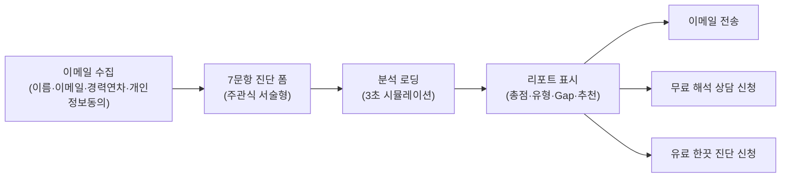
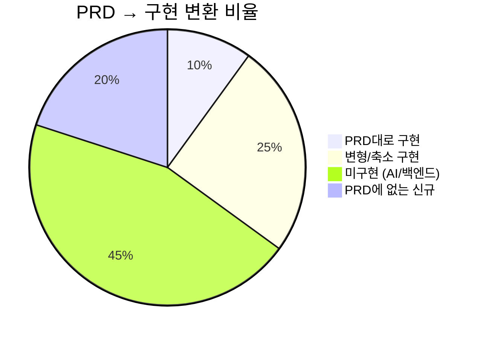

# PRD v0.4.2 vs 현재 구현 사이트 — 변경점 상세 분석

> **분석 기준일**: 2026-05-27  
> **PRD 버전**: v0.4.2 ([PRD_v1.md](file:///e:/꿈몰다/외부사업/2026/모두의연구소/career-translate-lab/docs/PRD_v1.md))  
> **구현 코드**: `career-translate-lab` 프로젝트 (Vite + React + TypeScript + TailwindCSS)

---

## 📋 요약 — 핵심 변경 7가지

| # | 변경 영역 | PRD 원본 | 현재 구현 | 변경 정도 |
|:---:|:---|:---|:---|:---:|
| 1 | **서비스 명칭** | 5060 프리미엄 브랜드 매니지먼트 | **한끗프로젝트** | 🔴 전면 변경 |
| 2 | **가격 체계** | Option A 650만 / Option B 880만 / 리테이너 월 50~100만 | **4단계: 50만 → 350만 → 700만 → 월 100만** | 🔴 전면 재설계 |
| 3 | **진단 구조** | 42문항 기반, 축약 12~16문항 AI 진단 | **무료 7문항 자가 진단** + 유료 60분 인터뷰 | 🔴 전면 변경 |
| 4 | **AI 기능** | F1~F15 고도화 (AI 마스터 브리프, 패턴 분류, 코칭 피드백 등) | **클라이언트 로컬 점수 알고리즘** (AI API 미연동) | 🔴 미구현 |
| 5 | **타깃 표현** | 5060 고경력 전문가 (퇴직·전환기 임원, 연구원, 전문직) | **30년 경력 시니어 전문가** (더 넓은 범위) | 🟡 톤 변경 |
| 6 | **기술 스택** | Next.js + Supabase + Claude API | **Vite + React + 로컬 Zustand** (백엔드 없음) | 🔴 전면 변경 |
| 7 | **코칭 흐름** | 4단계 Stage 구조 (Stage 1→1차 세션→Stage 3→2차 세션) | **4단계 상품 구조** (진단→빌드→론칭→파트너) | 🟡 재해석 |

---

## 1. 서비스 브랜드 & 정체성 — 전면 변경

### PRD 원본
- **서비스명**: "5060 프리미엄 브랜드 매니지먼트"
- **운영 주체**: "브랜드 매니지먼트 사업부 (대표 1인 + AI Ops)"
- **포지셔닝**: "Done-for-you 프리미엄 매니지먼트 시스템"
- **제품 비전**: "42문항 구조화 인터뷰 기반으로 진단하고, 답변 패턴을 해석한 뒤, 브랜드 프로필·B2B 제안서·강의안으로 변환하는 AI 기반 코칭 시스템"

### 현재 구현
- **서비스명**: **"한끗프로젝트"** — [Index.tsx](file:///e:/꿈몰다/외부사업/2026/모두의연구소/career-translate-lab/src/pages/Index.tsx)
- **운영 주체**: "꿈몰다 이화진 대표" — 구체적 실명 노출
- **포지셔닝**: **"경력 자산화 서비스"** — AI 기반이 아닌 **1:1 맞춤 서비스**로 재정의
- **핵심 카피**: "30년을 일했는데, 나를 소개하는 한 문장이 없습니다"

> [!IMPORTANT]
> PRD는 AI 시스템 중심의 SaaS를 설계했으나, 현재 구현은 **사람(코치) 중심의 프리미엄 서비스**를 판매하는 랜딩페이지입니다. AI는 보조 도구가 아닌, **아예 노출되지 않는 상태**입니다.

---

## 2. 가격 체계 — 전면 재설계

### PRD 원본 (§11-4)

| 패키지 | 가격 | 포함 내용 |
|:---|:---|:---|
| Option A | 650만 원 | 브리프 + 에셋 6종 |
| Option B | 880만 원 | 브리프 + 에셋 12종 + 제안서 + 강의안 |
| 리테이너 | 월 50~100만 원 | 월정액 관리 |

### 현재 구현 — [Index.tsx 패키지 섹션](file:///e:/꿈몰다/외부사업/2026/모두의연구소/career-translate-lab/src/pages/Index.tsx#L340-L441)

| STEP | 상품명 | 가격 | 기간 | 포함 내용 |
|:---:|:---|:---|:---:|:---|
| 1 | **한끗 진단** | 50만 원 | 1주 | 1:1 인터뷰 60분, 진단 리포트, 자산화 로드맵, 해석 미팅 30분 |
| 2 | **한끗 빌드** | 350만 원 | 6주 | 심층 인터뷰 2회, 브랜드 메시지, 프로필, 강의안, 제안서, 채널 전략, 코칭 6회 |
| 3 | **한끗 론칭** | 700만 원 | 3개월 | 빌드 전체 + 리허설 2회, 온라인 프로필 제작, 기회 발굴 소개 |
| 4 | **한끗 파트너** | 월 100만 원 | 월단위 | 월 2회 코칭, 콘텐츠 리뷰, 기회 탐색, 분기별 점검 리포트 |

> [!WARNING]
> PRD의 2단계 가격(650만/880만)이 **4단계 점진적 가격**으로 완전 재구성되었습니다. 최저가 진입점이 650만 → **50만 원**으로 대폭 낮아졌으며, "시작은 여기서"라는 배지로 진단 상품이 핵심 전환 퍼널이 되었습니다.

---

## 3. 진단 시스템 — 구조 전면 변경

### PRD 원본 (§4)

| 항목 | PRD 설계 |
|:---|:---|
| **전체 문항** | 42문항 (PART 1~4 / Stage 1~4) |
| **MVP 축약** | 12~16문항 (Q1,Q2,Q4,Q6,Q7,Q8,Q9,Q11,Q13,Q15,Q26,Q28,Q33,Q40,Q41,Q42) |
| **진단 방식** | 웹 기반 AI 진단 → 즉시 리포트 출력 → CTA |
| **진단 비용** | 무료 (리드 퍼널) |
| **분석 엔진** | Claude 3.5 API + 답변 패턴 분류 (F10) + 브랜딩 요소 태깅 (F9) |

### 현재 구현 — [Diagnosis.tsx](file:///e:/꿈몰다/외부사업/2026/모두의연구소/career-translate-lab/src/pages/Diagnosis.tsx) + [content.ts](file:///e:/꿈몰다/외부사업/2026/모두의연구소/career-translate-lab/src/data/content.ts#L203-L253)

| 항목 | 현재 구현 |
|:---|:---|
| **전체 문항** | **7문항** (무료 자가 진단) |
| **진단 방식** | 이메일 수집 → 7문항 작성 → **클라이언트 로컬 분석** → 리포트 → 이메일 전송 → 상담 신청 |
| **진단 비용** | **완전 무료** |
| **분석 엔진** | **로컬 JavaScript 함수** (`analyzeFree()`) — AI API 미연동 |
| **리포트 항목** | 총점, 유형 분류 (4종), 영역별 Gap 분석, 추천 패키지 |

#### 무료 진단 7문항 vs PRD 42문항 매핑

| 무료 Q# | 질문 내용 | PRD 대응 질문 | PRD 브랜딩 요소 |
|:---:|:---|:---:|:---|
| Q1 | 직함 없이 자기소개 | **Q1** | 브랜드 정체성 |
| Q2 | 가장 자랑스러운 순간 3가지 | **Q2** | 핵심 가치 체계 |
| Q3 | 자연스럽게 잘 되는 것 3가지 | **Q11** | 강점 & 전문성 |
| Q4 | 사람들이 도움 구하는 분야 | **Q12** | 자연 권위 영역 |
| Q5 | 돕고 싶은 사람 (마음 상태) | **Q26** | 이상적 고객 (심리) |
| Q6 | 같은 경력 중 차별점 | **Q35** | USP |
| Q7 | 세상에 전하고 싶은 메시지 | **Q41/Q42** | 핵심 메시지 / WHY |

> [!NOTE]
> PRD의 16문항 축약 목록(Q1,Q2,Q4,Q6,Q7,Q8,Q9,Q11,Q13,Q15,Q26,Q28,Q33,Q40,Q41,Q42)에서 일부를 가져오되, **7문항으로 더 압축**되었습니다. PRD에서 중요시한 Q6(의사결정 기준), Q8(전환점 스토리), Q15(실패 경험), Q28(채널), Q33(타깃 인구통계) 등은 생략되었습니다.

---

## 4. 진단 유형 분류 — 체계 변경

### PRD 원본 (§5-1)
10개 답변 패턴: P1 직함 중심형, P2 가치 중심형, P3 자기축소형, P4 회피형, P5 모든 사람 타깃형, P6 경험 나열형, P7 방법론 보유형, P8 채널 과욕형, P9 실패 통합형, P10 실패 회피형

### 현재 구현 — [content.ts](file:///e:/꿈몰다/외부사업/2026/모두의연구소/career-translate-lab/src/data/content.ts#L136-L159)

**2가지 별도 유형 체계가 공존**:

#### (A) 유료 진단 유형 (4종) — `DiagnosisType`
| 유형 | 이름 | PRD 대응 |
|:---|:---|:---|
| `title-dependent` | 직함 의존형 | P1 직함 중심형 |
| `experience-list` | 경험 나열형 | P6 경험 나열형 |
| `hidden-expert` | 숨은 전문성형 | P3 자기축소형 + P7 방법론 보유형 |
| `market-ready` | 시장 진입 준비형 | (PRD에 없는 신규 유형) |

#### (B) 무료 진단 유형 (4종) — `FreeDiagnosisType`
| 유형 | 이름 | 설명 |
|:---|:---|:---|
| `explorer` | 탐색형 브랜더 🔍 | 방향 찾는 중 |
| `preparer` | 준비형 브랜더 📦 | 재료는 있지만 정리 안 됨 |
| `transitioner` | 전환형 브랜더 🔄 | 변화의 시기 |
| `executor` | 실행형 브랜더 🚀 | 실행만 남음 |

> [!IMPORTANT]
> PRD의 10개 **답변 패턴**(문제 진단 관점)이 구현에서는 4개 **브랜더 유형**(포지셔닝 관점)으로 바뀌었습니다. AI 분류기(F10)가 아닌 **규칙 기반 로컬 알고리즘**으로 판별합니다.

---

## 5. AI 기능 (F1~F15) — 대부분 미구현

### PRD의 15개 기능 vs 구현 상태

| 기능 | PRD 설명 | 구현 상태 | 비고 |
|:---|:---|:---:|:---|
| **F1** | AI 마스터 브리프 생성기 (Claude API) | ❌ 미구현 | |
| **F2** | AI 브랜드 진단 툴 (12~16문항) | 🟡 변형 구현 | 7문항 로컬 분석으로 대체 |
| **F3** | 관리자 콘솔 | 🟡 부분 구현 | 리드 관리 테이블만 존재 |
| **F4** | 리드 DB (Supabase) | 🟡 변형 구현 | **Zustand + localStorage**로 대체 |
| F5 | 고객 트래킹 대시보드 | ❌ 미구현 | V2 |
| F6 | 리테이너 구독 관리 | ❌ 미구현 | V2 |
| F7 | STT 연동 | ❌ 미구현 | V2 |
| F8 | PPT 자동 Export | ❌ 미구현 | V2 |
| **F9** | Question Architecture Engine | ❌ 미구현 | |
| **F10** | Answer Pattern Classifier | ❌ 미구현 | 로컬 규칙으로 최소 대체 |
| **F11** | Branding Output Mapper | ❌ 미구현 | |
| F12 | Coaching Feedback Generator | ❌ 미구현 | V1.5 |
| F13 | Report Generation Rule Engine | ❌ 미구현 | V1.5 |
| F14 | Human Coaching Handoff | ❌ 미구현 | V2 |
| **F15** | Coach Session Brief Generator | ❌ 미구현 | |

> [!CAUTION]
> PRD에서 MVP Must로 지정한 **F1, F2, F3, F4, F9, F10, F11, F15** 중 완전 구현된 것은 **없습니다**. 현재 사이트는 AI 연동 없는 **프론트엔드 랜딩페이지 + 무료 자가진단 퍼널**입니다.

---

## 6. 기술 스택 — 전면 변경

| 영역 | PRD 설계 | 현재 구현 |
|:---|:---|:---|
| **프레임워크** | Next.js | **Vite + React + TypeScript** |
| **CSS** | (미명시) | **TailwindCSS** |
| **DB / Backend** | Supabase (PostgreSQL + JSONB) | **없음** — Zustand + localStorage |
| **AI API** | Claude 3.5 API | **미연동** |
| **인증** | OAuth 제외 (V1 Out) | 로그인 페이지 존재하나 미구현 |
| **배포** | (미명시, 웹 기반) | dist 폴더 존재 (빌드 완료 상태) |
| **UI 프레임워크** | (미명시) | **shadcn/ui + Radix UI** |
| **모니터링** | Datadog/Sentry/GA4 | **미연동** |

---

## 7. 페이지 구조 — PRD에 없는 신규 페이지

### 현재 구현 페이지 ([App.tsx](file:///e:/꿈몰다/외부사업/2026/모두의연구소/career-translate-lab/src/App.tsx))

| 경로 | 페이지 | PRD 대응 | 비고 |
|:---|:---|:---|:---|
| `/` | **랜딩 (Index)** | 랜딩페이지 (§12-1 In) | ✅ 구현됨 — 히어로+비교표+프로세스+상품+FAQ+CTA |
| `/service` | **서비스 소개** | PRD에 미명시 | 🆕 **신규** — 방법론 3단계 (추출→번역→자산화), 산출물 6종, 신뢰 섹션 |
| `/diagnosis` | **무료 자가 진단** | F2 AI 진단 툴 | 🟡 변형 — 7문항 무료 진단으로 변경 |
| `/result` | **진단 결과** | 진단 리포트 웹뷰 (§12-1 In) | 🟡 변형 — 5차원 스코어 + 패키지 추천 |
| `/consultation` | **상담 신청** | 상담 CTA (§11-3) | 🟡 변형 — 무료/유료 2종 분기 |
| `/admin` | **관리자 콘솔** | F3 관리자 콘솔 | 🟡 축소 — 리드 테이블만 |
| `/login` | **로그인** | PRD에 명시적 제외 (OAuth Out) | 🆕 **신규** — 페이지 존재하나 기능 미완 |

---

## 8. 고객 여정 퍼널 — 재설계

### PRD 원본
```
축약 12~16문항 AI 진단 (무료)
  → 진단 리포트 + CTA
  → 42문항 인터뷰 참여
  → AI 마스터 브리프 + 코칭 피드백
  → 완성 자산으로 B2B 영업
```

### 현재 구현
```
무료 7문항 자가 진단 (이메일 수집)
  → 즉시 리포트 (로컬 분석)
  → 2가지 분기:
    ├─ 무료 해석 상담 신청 (자가 진단 기반 30분 미팅)
    └─ 정식 한끗 진단 신청 (50만 원, 60분 인터뷰)
  → 한끗 빌드 (350만 원) 업셀
  → 한끗 론칭 (700만 원) 업셀
  → 한끗 파트너 (월 100만 원)
```

> [!NOTE]
> PRD의 **AI 주도 퍼널** (자동 진단 → 자동 브리프 → CTA)이 **사람 코치 주도 퍼널** (무료 자가 진단 → 전문가 해석 상담 → 유료 프로그램)로 변경되었습니다.

---

## 9. 관리자 콘솔 — 대폭 축소

### PRD 원본 (F3)
- 인터뷰 Raw 입력 → AI 변환 결과 + 코칭 인사이트 메모 일괄 반환 → 검수 UI
- 코치 분석 노트 6항목 검수·승인·거부
- 원라이너 초안 수정
- 사람 코치 핸드오프 플래그 처리
- AI 해석 메모 태깅 (일반론 여부)
- 환각(Hallucination) 거부 기능

### 현재 구현 — [Admin.tsx](file:///e:/꿈몰다/외부사업/2026/모두의연구소/career-translate-lab/src/pages/Admin.tsx)
- 리드 목록 테이블 (이름, 연락처, 점수, 유형, 패키지)
- **상태 변경**: 신규 리드 → 상담 예정 → 상담 완료 → 제안서 발송 → 계약 완료 → 보류
- **메모 입력**: 자유 텍스트
- **상세 보기**: 무료 진단 7문항 답변 전문, 영역별 점수, 상담 세부 정보
- **인증 없음**: `AdminGate` 컴포넌트가 빈 패스스루

> [!WARNING]
> PRD의 AI 검수 기능, 코칭 노트 검수, 핸드오프 플래그 등은 전혀 구현되지 않았습니다. 현재 관리자 콘솔은 **CRM 리드 관리** 수준입니다.

---

## 10. 데이터 구조 — 전면 변경

### PRD 원본 (§10)
- **Supabase** PostgreSQL + JSONB
- LEAD, DIAGNOSIS, CLIENT, PROJECT, BRIEF, BRAND_PROFILE, RETAINER 엔터티
- 42개 OUTPUT 변수 스키마 (`identity_baseline`, `brand_why_final` 등)
- `answer_outputs` JSONB 필드 (42종 변수 누적)

### 현재 구현
- **Zustand + localStorage**: 2개 스토어
  - [freeDiagnosticStore.ts](file:///e:/꿈몰다/외부사업/2026/모두의연구소/career-translate-lab/src/store/freeDiagnosticStore.ts) — 무료 진단 상태 (step, lead, answers, result)
  - [leads.ts](file:///e:/꿈몰다/외부사업/2026/모두의연구소/career-translate-lab/src/store/leads.ts) — 상담 리드 관리
- **영역별 점수** (4개): identity, strengths, target, differentiation
- **42개 OUTPUT 변수**: 미구현

---

## 11. 콘텐츠 전략 — 재해석

### PRD에서 "제품 기능"으로 정의했지만 현재 "마케팅 콘텐츠"로 구현된 항목들

| PRD 기능/개념 | 현재 구현 위치 | 구현 방식 |
|:---|:---|:---|
| 42문항 코칭 프레임워크 (§3) | 서비스 페이지 방법론 | "추출→번역→자산화" 3단계로 **단순화** |
| 브랜드 프로필 8개 섹션 (§6-2) | 서비스 페이지 산출물 | 6종 산출물로 변경 (원라이너, 프로필, 강의안, 제안서, 채널 전략, 소개 멘트) |
| Stage 1~4 코칭 흐름 (§7-0-2) | 랜딩페이지 프로세스 | "경험 인터뷰 → 브랜드 기획 → 문서 제작 → 기회 탐색" 4단계로 **재해석** |
| P1~P10 답변 패턴 분류 (§5-1) | 미노출 | 고객에게 노출하지 않는 내부 분석 도구로 전환 |
| 5060 페르소나 5인 (§2) | 미노출 | 사이트에서 구체적 페르소나 미언급 |

---

## 12. 산출물 구성 — 변경

### PRD 원본 (§6-1) — 8개 브랜딩 요소
1. 브랜드 원라이너, 프로필 소개문
2. 가치 선언문, 브랜드 WHY
3. USP 문장, 방법론 프레임워크
4. 핵심 에피소드, 강연 오프닝 스크립트
5. 타깃 페르소나 카드
6. 포지셔닝 스테이트먼트
7. 채널 전략
8. 브랜드 약속, 사회적 임팩트 선언

### 현재 구현 ([Service.tsx 산출물 섹션](file:///e:/꿈몰다/외부사업/2026/모두의연구소/career-translate-lab/src/pages/Service.tsx#L225-L257)) — 6종 산출물

| # | 산출물 | PRD 대응 |
|:---:|:---|:---|
| D01 | **한 줄 포지셔닝** | 브랜드 원라이너 + 포지셔닝 스테이트먼트 통합 |
| D02 | **전문가 프로필 1페이지** | 프로필 소개문 |
| D03 | **대표 강의안 (60분)** | PRD에서는 V2 산출물이었음 → 핵심 산출물로 **격상** |
| D04 | **B2B 제안서 템플릿** | PRD와 동일 |
| D05 | **채널 전략 가이드** | 채널 전략과 유사 |
| D06 | **소개 멘트 30초·60초** | PRD에 없는 🆕 **신규 산출물** |

> [!NOTE]
> PRD의 "가치 선언문", "타깃 페르소나 카드", "브랜드 스토리", "브랜드 약속" 등 내부 자산이 **삭제**되고, 대신 시장에서 **즉시 활용 가능한** 실물 산출물로 압축되었습니다. "소개 멘트" 산출물은 PRD에 없는 신규 추가입니다.

---

## 13. 무료 진단 플로우 — PRD에 없는 완전 신규

현재 구현에만 존재하는 **5단계 무료 진단 플로우**:



- **컴포넌트 구조**: [EmailCollect](file:///e:/꿈몰다/외부사업/2026/모두의연구소/career-translate-lab/src/components/free-diagnosis/EmailCollect.tsx) → [DiagnosisForm](file:///e:/꿈몰다/외부사업/2026/모두의연구소/career-translate-lab/src/components/free-diagnosis/DiagnosisForm.tsx) → [AnalysisLoading](file:///e:/꿈몰다/외부사업/2026/모두의연구소/career-translate-lab/src/components/free-diagnosis/AnalysisLoading.tsx) → [Report](file:///e:/꿈몰다/외부사업/2026/모두의연구소/career-translate-lab/src/components/free-diagnosis/Report.tsx) → [Complete](file:///e:/꿈몰다/외부사업/2026/모두의연구소/career-translate-lab/src/components/free-diagnosis/Complete.tsx)

---

## 14. 상담 신청 — 이중 퍼널 신규 구현

### PRD 원본
- 진단 리포트 하단 CTA 버튼 → 프리미엄 매니지먼트 상담

### 현재 구현 — [Consultation.tsx](file:///e:/꿈몰다/외부사업/2026/모두의연구소/career-translate-lab/src/pages/Consultation.tsx)

**2개 분리된 폼**:
1. **`?type=paid`** — 정식 한끗 진단 신청 (50만 원)
   - 상세 경력 기술 필수
   - 최종 희망 브랜드 자산 종류 선택
   - 상품 패키지 정보 노출

2. **(기본)** — 1:1 무료 해석 상담 신청 (30분)
   - 자가 진단 결과 미완료 시 **모달로 진단 유도**
   - 진단 갭 데이터 자동 연동
   - 상담 목적·고민 사항 입력

---

## 15. PRD에서 제거/보류된 핵심 요소 정리

| PRD 요소 | 상태 | 사유 추정 |
|:---|:---:|:---|
| 42문항 전체 인터뷰 | 보류 | MVP 단계에서 과도한 범위 |
| Claude 3.5 API 연동 | 미구현 | 프론트엔드 프로토타입 단계 |
| Supabase DB | 미구현 | 로컬 프로토타입으로 충분 |
| 답변 패턴 AI 분류기 (F10) | 미구현 | AI API 연동 필요 |
| 코치 세션 브리프 생성기 (F15) | 미구현 | AI API 연동 필요 |
| 교차 검증 매트릭스 (§5-5) | 미구현 | F1/F15 의존 |
| 42개 OUTPUT 변수 스키마 (§10-3) | 미구현 | DB 연동 필요 |
| 환각 검출 / 검수 UI | 미구현 | AI 미연동 상태 |
| GA4 / Datadog / Sentry 모니터링 | 미구현 | 프로토타입 단계 |
| 5060 페르소나 5인 (김명진, 정재호 등) | 삭제 | 사이트에 구체적 페르소나 비노출 |
| 경쟁사 비교 (전직 지원·코칭·매칭 플랫폼) | 변형 | "강사 양성 과정" vs "브랜딩 컨설팅" vs "한끗" 3자 비교로 변경 |

---

## 16. 현재 구현에만 있는 신규 요소

| 요소 | 위치 | PRD에 없는 이유 추정 |
|:---|:---|:---|
| **한끗프로젝트 브랜드명** | 전체 | 브랜딩 결정 후 적용 |
| **이화진 대표 프로필 사진 & 실적** | Service.tsx | 마케팅 랜딩페이지 요소 |
| **프로그램 상세 안내서 다운로드 (Google Drive)** | Service.tsx | 영업 자료 |
| **FAQ 5문항** | Index.tsx | 마케팅 콘텐츠 |
| **30초·60초 소개 멘트 산출물** | Service.tsx | 고객 요구 반영 |
| **무료 진단 → 무료 해석 상담 2단계 퍼널** | Consultation.tsx | 전환율 최적화 |
| **진단 미완료 시 모달 팝업 유도** | Consultation.tsx | UX 전환 최적화 |
| **경력 연차 옵션** (5년~30년+) | content.ts | 자가 진단 세그멘테이션 |

---

## 📊 종합 평가



### 핵심 요약

현재 사이트는 PRD v0.4.2의 **마케팅 프론트엔드 레이어**만을 프로토타입으로 구현한 상태입니다:

1. **✅ 잘 반영된 것**: 5060 경력자 대상의 핵심 Pain Point, "경력 언어화 실패" 문제 인식, 질문 기반 진단 → 리포트 → CTA 퍼널 구조
2. **🔴 전면 변경된 것**: 서비스명, 가격 체계, 진단 문항 수, 기술 스택
3. **❌ 미구현된 것**: AI 엔진 전체 (F1~F15), 백엔드/DB, 42문항 시스템, 교차 검증, 코칭 흐름 자동화
4. **🆕 신규 추가된 것**: 한끗프로젝트 브랜딩, 4단계 가격 체계, 7문항 무료 진단, 이중 상담 퍼널, FAQ, 대표 프로필 섹션
