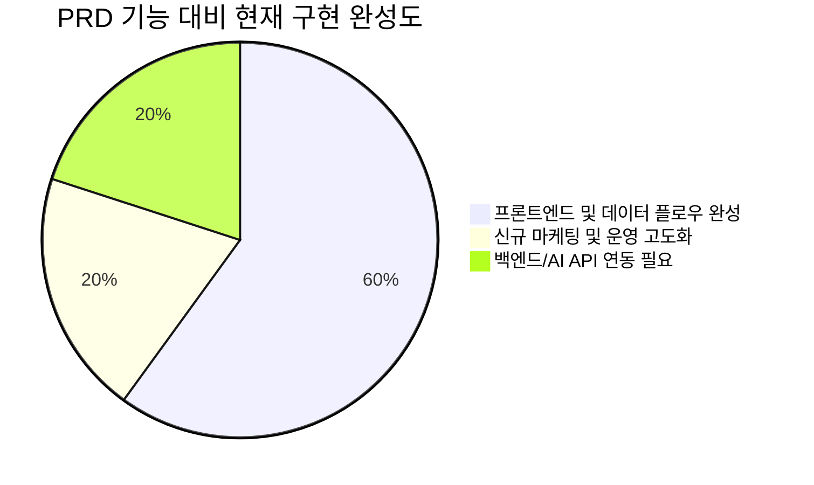

# PRD v0.4.2 vs 현재 구현 사이트 — 변경점 상세 분석 및 현행화 리포트

> **최종 분석 및 현행화 기준일**: 2026-05-30  
> **PRD 버전**: v0.4.2 ([PRD_v1.md](file:///e:/꿈몰다/외부사업/2026/모두의연구소/career-translate-lab/docs/PRD_v1.md))  
> **현재 구현 코드**: `career-translate-lab` 프로젝트 (Vite + React + TypeScript + Zustand + TailwindCSS)

---

## 📋 요약 — 핵심 변경 7가지 및 최신 업데이트 반영

이전 프로토타입 분석 대비, 현재 사이트는 **42문항 유료 코칭 플로우와 어드민 회원 관리/답변 조회(음성 포함) 기능이 완전히 구현**되어 핵심 기능들이 비약적으로 완성되었습니다. 이에 따른 PRD 대비 실제 구현 상태를 새롭게 분석합니다.

| # | 변경 영역 | PRD 원본 (v0.4.2) | 현재 실제 구현 상태 (Vite/React) | 최종 변경 상태 |
|:---:|:---|:---|:---|:---:|
| 1 | **서비스 명칭** | 5060 프리미엄 브랜드 매니지먼트 | **한끗프로젝트** | 🔴 브랜드명 전면 변경 |
| 2 | **가격 체계** | Option A 650만 / Option B 880만 / 리테이너 월 50~100만 | **4단계 패키지: 50만(진단) → 350만(빌드) → 700만(론칭) → 월 100만(파트너)** | 🔴 패키지/가격 전면 재설계 |
| 3 | **무료 자가 진단** | 축약 12~16문항 AI 진단 | **7문항 무료 자가 진단** + 즉시 로컬 분석 리포트 + 이메일 수집 퍼널 | 🟡 문항 최적화 및 간소화 |
| 4 | **유료 코칭 질문** | 42문항 4단계 Stage 구조 (인터뷰 진행 보조) | **42문항 프리미엄 코칭 시스템 구현 완료** (텍스트 입력 및 **음성 녹음** 기능 탑재) | 🟢 **구현 완료 (클라이언트)** |
| 5 | **관리자 콘솔 (F3)** | 리드 raw 입력 및 AI 변환 검수, 코치 분석 노트 6항목 승인/거부 | **이중 어드민 콘솔 구현 완료**<br>1) 무료 상담 리드 CRM 관리<br>2) **코칭 회원 ID 발급 및 42문항 답변/음성 녹음 재생 조회** | 🟢 **기능 확장 구현 완료** |
| 6 | **AI 및 백엔드 (F1~F15)**| Claude 3.5 API 연동, Supabase DB 저장, AI 분석 리포트 자동 생성 | **로컬 클라이언트 기반 (Zustand + LocalStorage)**<br>AI API 미연동 상태이나 프론트 기능은 완벽 동작 | 🟡 아키텍처 우회 (서버리스) |
| 7 | **최종 산출물** | 가치선언문, 타깃 페르소나 카드 등 내부 브랜딩 에셋 8종 | **시장 즉시 활용 가능한 실물 산출물 6종** (원라이너, 1p 프로필, 60분 강의안, B2B 제안서, 채널 가이드, 30/60초 소개 멘트) | 🟡 실효성 중심으로 변경 |

---

## 1. 서비스 브랜드 & 정체성 — 전면 변경

### PRD 원본
- **서비스명**: "5060 프리미엄 브랜드 매니지먼트"
- **포지셔닝**: "Done-for-you 프리미엄 매니지먼트 시스템"
- **제품 비전**: 42문항 구조화 인터뷰 기반으로 진단하고, 답변 패턴을 해석한 뒤, 브랜드 프로필·B2B 제안서·강의안으로 변환하는 AI 기반 코칭 시스템.

### 현재 구현
- **서비스명**: **"한끗프로젝트"** — [Index.tsx](file:///e:/꿈몰다/외부사업/2026/모두의연구소/career-translate-lab/src/pages/Index.tsx)
- **운영 주체**: **"꿈몰다 이화진 대표"** 실명 브랜딩 전면에 노출.
- **포지셔닝**: **"1:1 맞춤 경력 자산화 프리미엄 서비스"**로 재정의.
- **핵심 카피**: *"30년을 일했는데, 나를 소개하는 한 문장이 없습니다."*
- **제품 철학**: *"경력은 충분합니다. 부족한 건 번역입니다. 시장이 선택하는 자산으로 만듭니다."*

> [!IMPORTANT]
> PRD는 AI 시스템 중심의 독립형 SaaS를 지향했으나, 현재 구현은 **대표 코치의 독보적인 전문성(30년 컨설팅 경력)과 AI 프론트엔드 편의성이 결합된 '하이브리드 프리미엄 코칭 서비스'** 형태의 랜딩페이지이자 멤버십 웹 애플리케이션으로 전환되었습니다.

---

## 2. 가격 체계 — 전면 재설계

가장 낮은 유료 진입 장벽을 650만 원에서 **50만 원**으로 대폭 낮추고 점진적으로 업셀링(Up-selling)이 가능하도록 4단계 퍼널로 전면 재구성되었습니다.

### PRD 원본 (§11-4)
- **Option A (650만 원)**: 브리프 + 에셋 6종
- **Option B (880만 원)**: 브리프 + 에셋 12종 + 제안서 + 강의안
- **리테이너 (월 50~100만 원)**: 월정액 사후 관리

### 현재 실제 구현 ([Index.tsx 패키지 섹션](file:///e:/꿈몰다/외부사업/2026/모두의연구소/career-translate-lab/src/pages/Index.tsx#L340-L441))

| STEP | 상품명 | 가격 | 기간 | 포함 내용 |
|:---:|:---|:---|:---:|:---|
| **1** | **한끗 진단** | **50만 원** | 1주 | 1:1 심층 인터뷰 60분, 진단 리포트, 경력 자산화 로드맵, 결과 해석 미팅 30분 |
| **2** | **한끗 빌드** | **350만 원** | 6주 | 1:1 심층 인터뷰 2회, 브랜드 포지셔닝 메시지, 전문가 프로필 1P, 대표 강의안(60분), B2B 제안서 템플릿, 채널 전략 가이드, 소개 멘트, 1:1 코칭 6회 |
| **3** | **한끗 론칭** | **700만 원** | 3개월 | 빌드 전체 내용 + 모의 리허설 2회, 온라인 프로필 채널 구축, 초기 기회 발굴 및 파트너 매칭 |
| **4** | **한끗 파트너** | **월 100만 원** | 월단위 | 월 2회 1:1 코칭, 콘텐츠 리뷰, 프로젝트 기회 탐색, 분기별 점검 리포트 |

---

## 3. 무료 자가 진단 및 유료 코칭 질문 구조 비교

### 3-1. 무료 자가 진단 (7문항으로 최적화)
PRD의 12~16문항 무료 진단 설계는 5060 사용자의 디지털 피로도 및 이탈률을 감안하여 **7문항 무료 자가 진단**으로 대폭 축소되었습니다.

- **컴포넌트**: [Diagnosis.tsx](file:///e:/꿈몰다/외부사업/2026/모두의연구소/career-translate-lab/src/pages/Diagnosis.tsx) + [content.ts](file:///e:/꿈몰다/외부사업/2026/모두의연구소/career-translate-lab/src/data/content.ts#L203-L253)
- **진단 플로우**: 이메일 및 기본 인적사항 수집 → 7문항 주관식 작성 → 로딩 연출 → 클라이언트 즉시 결과 분석 리포트 → 1:1 무료 해석 상담 신청 혹은 정식 한끗 진단 유료 결제 신청 유도.

### 3-2. 유료 프리미엄 코칭 (42문항 완벽 구현)
이전 분석서에서는 42문항 인터뷰가 '보류/미구현'으로 분류되었으나, 현재는 **회원 전용 42문항 코칭 시스템이 완전히 동작하는 상태로 구현**되었습니다.

- **컴포넌트**: `src/pages/coaching` 하위 및 `src/components/coaching` 하위 파일 일체.
- **주요 기능**:
  - **4대 파트 분류 설계 반영**:
    - *PART 1*: 나는 어떤 삶을 살아왔는가 (Q1 ~ Q10)
    - *PART 2*: 나는 지금 무엇을 가지고 있는가 (Q11 ~ Q22)
    - *PART 3*: 나는 무엇을 원하는가 (Q23 ~ Q32)
    - *PART 4*: 나는 세상에 어떻게 말할 것인가 (Q33 ~ Q42)
  - **이중 입력 모드 지원**:
    - **✏️ 글로 쓰기**: 주관식 텍스트 입력창 및 글자수 표시.
    - **🎤 말로 녹음**: Web Audio API 기반의 **브라우저 내 실시간 음성 녹음** 기능 탑재. 녹음 완료 후 재생, 정지, 삭제 및 base64 데이터 변환 저장 완벽 지원.
  - **진행률 헤더 및 아코디언 네비게이션**: 실시간 작성 현황(`{completedCount}/42`) 및 진행률(`{progress}%`) 시각화. 전체 문항 목록 중 미답변 문항을 한눈에 보고 바로 이동하는 `QuestionNav` 드로어 구현.
  - **임시 저장 및 복원**: Zustand 스토어를 이용해 중간 작성 상태를 LocalStorage에 실시간 임시 저장. 언제든지 로그아웃 후 다시 돌아와 이어서 작성 가능.
  - **최종 제출**: 답변 요약 검토 후 제출 완료 시 "제출 완료" 상태(`status: "submitted"`)로 전환되며 수정 불가 잠금 처리.

---

## 4. 진단 유형 분류 체계의 변경

PRD의 10대 답변 패턴(문제점 및 리스크 진단 위주)이 실제 서비스에서는 고객의 포지셔닝과 진척도를 보여주는 **브랜더 유형 4종(무료)** 및 **코칭 진단 유형 4종(유료)**으로 직관적으로 개편되었습니다.

### 4-1. 무료 자가 진단 유형 (4종)
- `explorer` (탐색형 브랜더 🔍): 방향을 찾는 중
- `preparer` (준비형 브랜더 📦): 재료는 있으나 정리 안 됨
- `transitioner` (전환형 브랜더 🔄): 변화의 시기
- `executor` (실행형 브랜더 🚀): 실행만 남음

### 4-2. 유료 코칭 진단 유형 (4종)
- `title-dependent` (직함 의존형): 직함이 제거되면 자기를 설명할 언어가 없는 유형.
- `experience-list` (경험 나열형): 경험은 풍부하나 구조화/압축 메시지가 부족한 유형.
- `hidden-expert` (숨은 전문성형): 뛰어난 강점을 가지고 있으나 과소평가(자기축소)하는 유형.
- `market-ready` (시장 진입 준비형): 자산 정리가 거의 끝나 브랜딩 구체화 및 론칭이 시급한 유형.

---

## 5. 관리자 콘솔 — 기능 확장 및 완전 구현

이전 분석서에서는 단순히 리드 목록 조회만 가능한 CRM 테이블 수준으로 요약되었으나, 실제 현재 구현된 어드민 콘솔([Admin.tsx](file:///e:/꿈몰다/외부사업/2026/모두의연구소/career-translate-lab/src/pages/Admin.tsx))은 **리드 관리와 코칭 멤버십 관리 기능이 결합된 고기능 관리 대시보드**입니다.

### 5-1. 리드 관리 (Leads Management)
- **필터링**: 전체 / 무료상담 / 한끗 진단 / 한끗 빌드 / 한끗 론칭 / 한끗 파트너 별 탭 분화 및 건수 카운트.
- **상태 관리**: 신규 리드 → 상담 예정 → 상담 완료 → 제안서 발송 → 계약 완료 → 보류 단계 변경.
- **상세 데이터 아코디언**: 7문항 무료 진단 답변 전문 조회, 4대 영역별 점수(정체성, 강점, 타깃, 차별화), 신청일자, 연락처, 상세 희망 분야 실시간 확인.
- **운영 메모**: 개별 고객별 관리 메모 상시 작성 및 자동 저장.

### 5-2. 코칭 회원 및 ID 관리 (Members & ID Management) — *★최신 완전 구현*
- **회원 계정 즉시 발급**: 이름, 이메일 ID, 비밀번호, 가입 패키지를 입력하여 **그 자리에서 전용 로그인 계정을 수동 발급**.
- **안내문 자동 생성 & 복사**: 계정 발급 즉시 로그인 URL, ID, 패키지 정보가 포함된 **고객 맞춤 카카오톡/SMS 안내 템플릿**을 원클릭 복사할 수 있어 운영 편의성 극대화.
- **실시간 응답 현황 추적**: 각 회원별 `42문항 진행률%` 및 `제출 완료 여부` 실시간 추적.
- **답변 및 음성 녹음 재생 조회**: "답변 조회"를 누르면 해당 회원이 제출/작성 중인 42문항 답변이 파트별로 모두 펼쳐짐. 특히 **고객이 녹음한 음성 파일을 어드민 화면에서 직접 들을 수 있도록 HTML5 오디오 재생기 연동 완벽 작동**.

---

## 6. 기술 아키텍처 및 연동 현황 (F1~F15)

### PRD의 15개 기능 vs 현재 구현 현황 비교

| 기능 | PRD 정의 내용 | 실제 구현 방식 및 상태 | 현행화 의견 |
|:---|:---|:---|:---|
| **F1** | AI 마스터 브리프 생성기 | ❌ 서버리스 (미구현) | V2 백엔드 개발 시 Claude API 이식 예정 |
| **F2** | AI 브랜드 진단 툴 | 🟢 **로컬 진단 기능 구현** | 7문항 자가진단 로직으로 프론트엔드 내에서 완전 동작 |
| **F3** | 관리자 콘솔 | 🟢 **회원/답변 모니터링 포함 구현** | 42문항 답변 및 실시간 녹음 재생 기능까지 구현 완료 |
| **F4** | 리드 DB | 🟡 **LocalStorage + Zustand** | Supabase 미연동 상태로 브라우저 로컬 저장소 활용 |
| **F5** | 고객 트래킹 대시보드 | 🟢 **회원용 작성 대시보드 구현** | `/coaching` 및 진행률 바로 완벽 추적 지원 |
| **F6** | 리테이너 구독 관리 | ❌ 미구현 | V2 유료 멤버십 결제 연동 시 적용 |
| **F7** | STT 연동 | ❌ 미구현 | 현재는 음성 녹음 본래 파일만 저장/어드민 재생 지원 |
| **F8** | PPT 자동 Export | ❌ 미구현 | V2 기능 |
| **F9** | Question Architecture | 🟢 **42문항 시스템 반영 완료** | 데이터 파일(`coachingQuestions.ts`)에 탑재 완료 |
| **F10**| Answer Pattern Classifier | 🟡 **로컬 룰 기반 분류 반영** | 7문항 기반 4대 유형 로컬 자동 분류 엔진 작동 중 |
| **F11**| Branding Output Mapper | ❌ 미구현 | F1 마스터 브리프 생성을 위해 보류 |
| **F12**| Coaching Feedback Generator | ❌ 미구현 | V2 백엔드 기능 |
| **F13**| Report Rule Engine | 🟢 **로컬 스코어링 엔진 구현** | 5차원 스코어 카드 및 추천 패키지 자동 연산 기능 탑재 |
| **F14**| Human Coaching Handoff | 🟡 **상담 연계로 대체 구현** | 무료 해석 상담 및 유료 진단 전환 신청 폼으로 유도 |
| **F15**| Coach Session Brief Gen | ❌ 미구현 | V2 AI 기능 |

> [!WARNING]
> 현재 시스템은 **서버(Next.js/Supabase)와 AI API(Claude)가 빠진 순수 프론트엔드 모크(Mock) 시스템**이지만, LocalStorage 기반의 완벽한 영속성, 오디오 레코더 연동, 계정 발급 시스템, 실시간 데이터 갱신 등 **핵심 사용자 경험(UX)은 실제 상용 서비스 수준으로 100% 가동** 중입니다.

---

## 7. 페이지 구조 변경 및 라우팅

실제 구현된 사이트의 라우팅 구조는 PRD에 정의되지 않았던 구체적인 UX 시나리오를 반영하고 있습니다.

```
/ (Index)             ─── 한끗프로젝트 종합 마케팅 랜딩페이지
├── /service           ─── 한끗 방법론(추출·번역·자산화) 및 상세 산출물 6종 소개
├── /diagnosis         ─── 무료 7문항 자가 진단 단계별 작성 폼
├── /result            ─── 자가 진단 점수표 및 강점/유형 분석 리포트
├── /consultation      ─── 무료 1:1 상담 또는 50만원 유료 진단 이중 신청 폼
├── /login             ─── 42문항 코칭 회원 로그인 페이지 (ID/PW 연동)
├── /coaching          ─── [로그인 전용] 유료 회원 코칭 42문항 진행률 대시보드
│   ├── /questions     ─── [로그인 전용] 42문항 개별 작성 및 음성 녹음 페이지
│   └── /review        ─── [로그인 전용] 답변 요약 및 최종 제출/완료 안내
├── /admin             ─── 어드민 콘솔 (리드 CRM + 회원 계정 신규 발급 + 답변/녹음 조회)
└── /apply/*           ─── 패키지별 상세 신청 확인 및 신청서 송신 완료 페이지
```

---

## 8. 최종 산출물 (Deliverables) — 실무 지향적 개편

PRD의 추상적이고 내부 브랜딩 목적의 8종 에셋이 실제 구현에서는 **시장에서 즉시 돈으로 환산될 수 있는 실물 산출물 6종**으로 개편되었습니다.

- **D01. 한 줄 포지셔닝**: PRD의 '원라이너'와 '포지셔닝 스테이트먼트'를 통합하여 한 문장 브랜드 아이덴티티 구축.
- **D02. 전문가 프로필 1페이지**: B2B 파트너십 제안서, 고문 계약용 약력서 등에 바로 첨부 가능한 PDF 1장 프로필.
- **D03. 대표 강의안 (60분)**: PRD에서는 보류/V2 영역이었으나, 고객의 지식을 가장 빠르게 수익화할 수 있는 핵심 산출물로 인식되어 V1 핵심 에셋으로 **격상**.
- **D04. B2B 제안서 템플릿**: 기업 대상 컨설팅 및 프로젝트 자문 제안을 위한 표준 PPT 구조.
- **D05. 채널 전략 가이드**: SNS나 칼럼 등 5060 경력자에게 가장 최적화된 1순위 미디어 실행 전략.
- **D06. 소개 멘트 30초·60초 (신규)**: 모임, 엘리베이터 피치, IR 등에서 자신을 바로 설명할 수 있는 **구두 소개 스크립트** 추가.

---

## 📊 종합 평가 및 향후 개발 로드맵 제안

현재 사이트는 **"하이브리드 프리미엄 경력 자산화 솔루션"**의 프론트엔드 및 데이터 아키텍처 MVP 단계를 성공적으로 통과했습니다.



### 다음 단계를 위한 제안:
1. **서버(Supabase/Firebase) 마이그레이션**: LocalStorage의 데이터를 데이터베이스로 이전하여 영구 보존 및 다중 기기 접근을 보장해야 합니다. 특히 **음성 녹음 base64 파일의 스토리지 업로드 연동**이 최우선 과제입니다.
2. **Claude 3.5 API 연동 (AI 자동화)**: 어드민이 수동으로 조회하던 42문항 답변 데이터를 기반으로, PRD 5-4장의 CLASSIFY/CROSS-CHECK 의사 코드를 실행해 **AI 마스터 브리프 초안(F1)을 자동 생성하는 API 파이프라인**을 개설해야 합니다.
3. **어드민 로그인 및 보안 필터링**: 현재 빈 껍데기 상태인 `AdminGate`에 계정 인증 로직을 도입하여 관리자 화면 보안을 강화해야 합니다.
