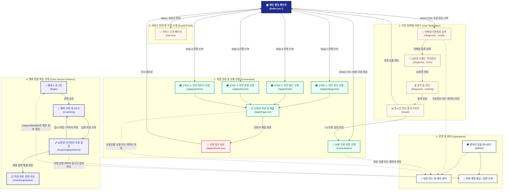

# 🎨 한끗 프로젝트 서비스 UX 플로우차트 및 분석 보고서

현재 **한끗 프로젝트(Career Translate Lab)** 서비스에 구현되어 있는 페이지와 데이터 흐름을 분석하여, 첨부해 주신 예시 이미지의 구조와 매칭된 프리미엄 서비스 UX 플로우차트를 구성하였습니다.

이 문서는 사용자의 동선(User Flow)에 따라 크게 5가지 핵심 영역으로 분류하여 구성하였으며, 각 단계에서의 CTA(Call To Action)와 데이터의 전환 및 관리 흐름을 한눈에 볼 수 있도록 설계했습니다.

---

## 📊 서비스 전체 UX 플로우차트 (Mermaid Diagram)

아래 다이어그램은 각 페이지 간의 유기적인 연결 흐름을 보여줍니다. 
각 영역별로 시각적인 구분을 위해 테마 컬러가 적용되었습니다.

---

## 📌 핵심 UX 플로우 상세 분석 및 비교 명세

예시로 제공해주신 이미지의 **[1. 핵심 서비스]**, **[2. Direct CTA]**, **[3. 신뢰 구축(Social Proof)]**, **[회원 가입/결제 완료]** 프레임워크를 현재 '한끗 프로젝트' 서비스 구조에 그대로 이식하여 상세하게 정리했습니다.

### 1️⃣ 가치 탐색형 서비스 (User Motivation)
> 사용자가 즉각 결제하기 전에, 자신의 현재 경력 상태를 객작적으로 돌아보고 흥미를 느낄 수 있게 유도하는 자가 진단 및 해석 장치입니다.

*   **진입 장벽 완화**: 회원가입 없이 **이메일 입력(`email`)**만으로 손쉽게 진단을 개시합니다.
*   **자가 진단 양식(`form`)**: 5대 경력 영역(정체성, 강점자산, 타깃설계, 차별화, 실행가능성)에 걸친 16문항 설문을 거칩니다.
*   **심리적 가치 제공(`loading` -> `result`)**: 전문적으로 설계된 **ScoreGauge(100점 만점)**와 5대 축 점수 및 세부 상태/리스크 리포트를 보며 사용자는 '경력 번역'의 절실한 필요성을 깨닫게 됩니다.
*   **상담 및 신청 연동**: 결과 리포트 하단에 `진단 결과 기반 1:1 상담 신청` 버튼을 노출하여 자연스럽게 다음 단계로 유도합니다.

### 2️⃣ 직접 상담 및 상품 신청 (Direct CTA)
> 랜딩페이지에서 확신을 가졌거나 진단 결과를 토대로 유료 서비스를 결심한 사용자가 전환되는 창구입니다.

*   **30분 무료 상담 신청 (`/consultation`)**:
    *   사용자의 기본 신상정보 외에 **상세 경력사항, 현재 겪는 도전과제, 상담 희망 방식(전화/카카오톡)**을 수집하여 맞춤형 상담을 준비합니다.
*   **단계별 유료 상품 신청 (`/apply/*`)**:
    *   **한끗 진단** (Step 1 | 50만 원)
    *   **한끗 빌드** (Step 2 | 350만 원)
    *   **한끗 론칭** (Step 3 | 700만 원)
    *   **한끗 파트너** (후속 리테이너 | 월 100만 원)
    *   신청서를 접수하면 자동으로 **신청 완료 페이지 (`/apply/thank-you`)**로 전환되며, 운영자에게 데이터가 기록됩니다.

### 3️⃣ 신뢰 구축 (Social Proof)
> 메인 랜딩 페이지만으로 정보가 부족하거나, 브랜드의 전문성에 신뢰가 필요한 고객을 위한 탐색 메뉴입니다.

*   **서비스 소개 (`/service`)**:
    *   한끗 프로젝트의 차별점(100% 대행 제작, PPT 노동 제로, 1:1 밀착 전담)을 구체적인 수치와 비교 데이터로 제공하여 의구심을 확실한 확신으로 전환합니다.

### 4️⃣ 멤버 전용 핵심 코칭 (Core Service Delivery)
> 유료 상품 결제가 확정된 회원을 관리자가 등록하여, 실제 '경력 자산화' 작업을 대행하기 위해 상세 데이터를 수집하는 워크플로우입니다.

*   **계정 발급 및 로그인 (`/login`)**:
    *   운영자가 발급한 계정(이메일 ID와 비밀번호)을 통해 한끗 멤버스 전용 공간에 접근합니다.
*   **코칭 대시보드 (`/coaching`)**:
    *   현재 **42문항 코칭 질문**의 답변 작성률(%)을 시각적으로 체감할 수 있는 프로그레스 바가 제공됩니다.
    *   **Part 1(내면 자산 발견)**, **Part 2(시장 가치 재정의)**, **Part 3(핵심 콘텐츠 설계)**의 3단계로 설계되어 단계별 완성도를 보여줍니다.
*   **자가진단 코칭 질문 작성 (`/coaching/questions`)**:
    *   텍스트 답변뿐만 아니라 **음성 녹음 파일(base64 인코딩 저장)**도 지원하여 바쁜 시니어 대표님들의 작성 피로도를 극적으로 낮춥니다.
    *   작성된 답변은 자동 임시저장되며, 최종 제출 완료 후 **리뷰 페이지(`/coaching/review`)**에서 복기가 가능합니다.

### 5️⃣ 운영 및 관리 (Operations)
> 서비스 뒷단에서 고객의 리드와 멤버 코칭 답변 데이터를 조율하고 액션을 취하는 운영 허브입니다.

*   **상담 리드 및 메모 관리 (`/admin` - Leads)**:
    *   무료 자가진단 고객의 16문항 답변 전문, 30분 무료 상담 내역, 유료상품 신청자 데이터를 한눈에 대조합니다.
    *   상태값(대기중, 상담중, 완료, 보류) 변경과 운영 메모 저장이 가능합니다.
*   **회원 계정 발급 및 답변 조회 (`/admin` - Members)**:
    *   새로운 수강 멤버를 생성하면 카카오톡/문자 전송용 포맷의 **계정 안내문구가 원클릭 자동 복사**됩니다.
    *   각 멤버가 작성 중이거나 제출 완료한 **42문항의 상세 답변(녹음 음성 플레이백 포함)을 즉시 조회**하여, 브랜드 기획 및 문서 대행 작업을 진행할 수 있습니다.

---

> [!TIP]
> **이 흐름도는 어떤 도구에든 즉시 이식 가능합니다!**
> 이 다이어그램은 표준 `Mermaid` 구문으로 작성되었으므로 Notion, GitHub, 혹은 다양한 다이어그램 도구(Mermaid Live Editor 등)에서 그대로 복사하여 사용할 수 있으며 고화질 이미지나 PDF로 추출할 수 있습니다.
